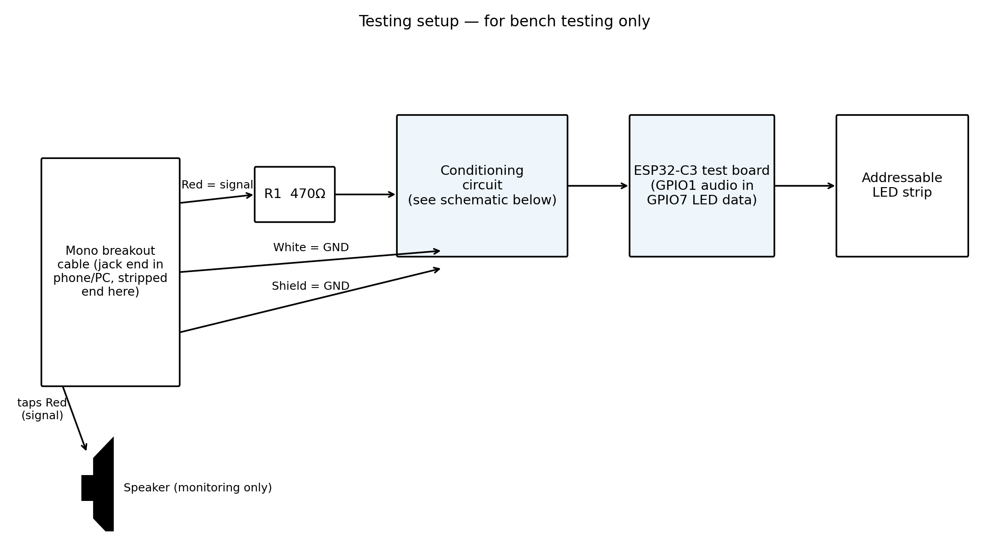
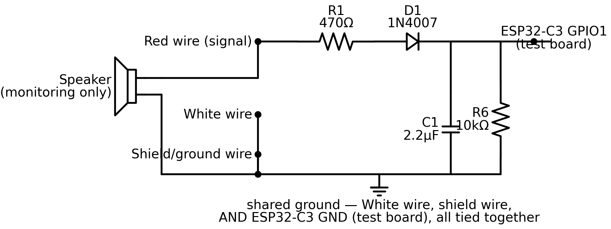
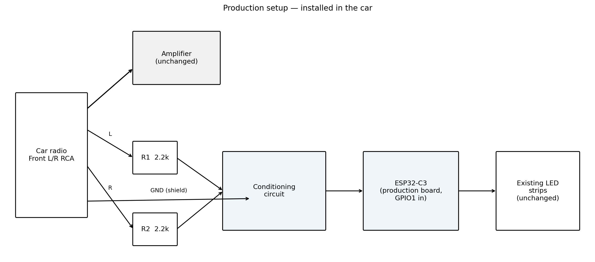
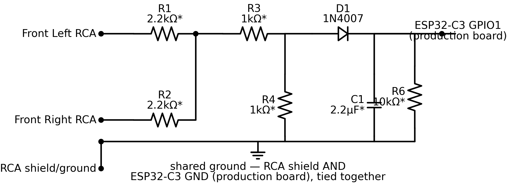

# Audio-Reactive LED Feature — Build Plan

A new, optional mode for the MR2 Reactive LEDs project: LEDs react to music from the car radio, in addition to the existing acceleration/braking/cornering reactivity. This is an addition layered on top of the completed core project — it does not replace or modify the existing v2.x firmware line.

---

## Circuit Design

**Note on D1 (the rectifier diode):** using a 1N4007 rather than the more typical small-signal choice (e.g. 1N4148) for this role, based on what was already on hand. The 1N4007 is a general-purpose power rectifier with much slower switching than a dedicated signal diode — normally a mismatch for audio-frequency work, but not a practical problem here, since the smoothing capacitor (C1) is deliberately the slow part of this circuit already, turning the rectified signal into a "how loud is the music right now" envelope over hundreds of milliseconds. The diode's speed was never going to be the limiting factor for something changing that slowly.

### Signal path overview

```
Front Left RCA  ──┐
Front Right RCA ──┼── mono-summed at the tap point
RCA ground/shield ─┘  (tapped in parallel — never cut the cable in series)
        │
        ▼
Conditioning circuit (see component list below)
        │
        ▼
ESP32 ADC pin (reads a 0–3.3V audio envelope)
        │
        ▼
Firmware: smooth, map to brightness/colour
        │
        ▼
WS2812B LED strips (existing LEFT_LED_PIN / RIGHT_LED_PIN)
```

### Testing setup — full pipeline



This is the complete bench-test signal path: a 3.5mm breakout cable (jack end into a phone or PC, stripped end wired to the circuit), summed and conditioned, into a spare ESP32-C3 module, driving the addressable LED strip. This is the testing configuration only — the production install uses the car's actual RCA tap and the ESP32-C3 installed in the car, not a phone/PC or this spare board.

A small monitoring speaker is also tapped across the R wire and shared ground (not part of the conditioning circuit itself) so you can hear what's actually playing while watching the LED/Serial response — useful for correlating specific sounds (bass hits, vocals, silence) with the tuned behaviour during Stage A/B below.

**Testing board update:** originally planned around a full ESP32 dev board (`GPIO34`/`GPIO5`). A spare ESP32-C3 module turned out to be available instead, which is actually simpler: it's the same chip as production, so the audio ADC pin (`GPIO1`) is identical on both, and Phase 2 tuning carries straight into Phase 4 with no pin remapping. See the updated pinout table below.

### Testing circuit — schematic



**⚠ Out of date:** this image still shows R5 and the old R3 value (10kΩ). Needs regenerating to match the component list below.

### Testing circuit — component list

```
White wire (L) → R1 (2.2kΩ) ──┐
Red wire (R)   → R2 (2.2kΩ) ──┼── Node S (mono sum)
Shield wire (ground) → GND
   (shared ground reference for the whole circuit — from a 3.5mm
   breakout cable, standard RCA-style white=L/red=R colour coding)

Node S → R3 (1kΩ) → Node A
Node A → R4 (1kΩ) → GND

Node A → D1 (1N4007) → Node B

Node B → C1 (2.2µF) → GND

Node B → R6 (10kΩ) → GND

Node B → ESP32-C3 (spare test module) GPIO1 (ADC input)
```

**R5 removed (design correction):** the original two-resistor bias network (R5 to 3.3V, R6 to GND) set Node B's resting/silent voltage at their midpoint, 1.65V. Worked through numerically against the R3/R4 divider's realistic output, that's a problem: D1 only conducts once Node A exceeds Node B's voltage by its own forward-voltage drop, so a 1.65V resting point demands roughly 2V+ at Node A just to register anything — but Node A's actual peak, after R3/R4 attenuation, is only ~0.14–0.51V for realistic laptop/car-radio signal levels. The diode would essentially never conduct; the circuit would sit at a fixed ~1.65V regardless of music. Dropping R5 and keeping R6 alone as the only path to ground brings the resting point down to ~0V instead, so D1 only needs to clear its own ~0.3–0.6V forward drop — well within reach of the signal actually available. This is also just the standard, single-resistor diode-envelope-detector topology; R5 wasn't buying anything a plain design doesn't already handle better. One secondary effect: removing R5 also removes it as a parallel discharge path, so the decay time constant becomes R6 × C1 alone (slower than before) — a minor factor folded into the R3/R4/C1 retuning already planned for Phase 2.

**R3 changed 10kΩ → 1kΩ (second design correction, same root cause):** the original 10kΩ:1kΩ divider (a ~0.09 ratio, ~11× attenuation) was sized to protect the ADC pin against an unconfirmed, possibly-hot car radio signal — the ESP32's ADC pin has a hard 3.3V maximum, and exceeding it risks damaging the chip, not just producing a bad reading. But worked through the actual numbers, that ratio is far more conservative than the protection goal needs: against a worst-case estimated ~5.6V peak (unconfirmed, from the ~4V RMS car-radio-voltage upper estimate), landing safely under 3.3V with real margin only requires roughly a 1:1 ratio (~0.45), not 11×. With R5 now gone and D1's threshold down to just its own ~0.3–0.6V forward drop, this leftover over-attenuation became the new bottleneck: the old ratio put a laptop's ~1.5V peak at only ~0.14V at Node A — likely still below the diode's threshold, making even bench testing marginal. R3 = R4 = 1kΩ (~0.5 ratio, ~2× attenuation) brings laptop peaks to ~0.75V and a low car-radio estimate (~2.8V peak) to ~1.4V, both clearing D1 comfortably, while the worst-case ~5.6V estimate still lands around 2.8V — under the 3.3V ceiling with margin. **Caveat:** the 5.6V worst-case itself is unconfirmed (the Kenwood DPX-07MD's actual preamp voltage was never measured), so treat this the same as every other `*`-marked value — a reasoned bench starting point, not a final answer; watch for ADC clipping once real radio access is available in Phase 3, per the headroom-tuning guidance below.

Values are starting points for Phase 2 — expect to retune R3/R4 (divider ratio) and C1 (smoothing, now also jointly setting decay rate with R6) once you're actually watching the LED respond to real music.

### Production setup — full pipeline



Same Y-split concept as the testing pipeline, now with the real components: the radio's Front L/R RCA (plus shield/ground) splits to the amplifier, completely unchanged, and separately to the new conditioning circuit → ESP32-C3 → the existing LED strips. No new strip or amp wiring — everything downstream of the ESP32-C3 already exists.

### Production circuit — schematic



**⚠ Out of date:** this image still shows R5 and the old R3 value (10kΩ). Needs regenerating to match the component list below.

### Production circuit — component list

```
Front Left RCA  → R1 (2.2kΩ*) ──┐
Front Right RCA → R2 (2.2kΩ*) ──┼── Node S (mono sum)
RCA shield/ground → GND
   (shared ground reference for the whole circuit — see Ground
   note below, this must be the RCA tap's own shield, not a
   separate chassis point)

Node S → R3 (1kΩ*) → Node A
Node A → R4 (1kΩ*) → GND

Node A → D1 (1N4007) → Node B

Node B → C1 (2.2µF*) → GND

Node B → R6 (10kΩ) → GND

Node B → ESP32-C3 GPIO1 (ADC input, production board)
```

`*` marks values expected to change once Phase 2 bench testing confirms what actually works — currently the same as the testing circuit's starting values. **Update both this schematic and this list with confirmed values before Phase 3 begins.** R6 isn't marked, since it's unlikely to need a value change beyond what the R3/R4/C1 retuning already covers — but see the R5-removal note above: earlier versions of this doc paired R6 with an R5 pull-up to 3.3V that turned out to make D1 never conduct at realistic signal levels, so R5 has been dropped from the design entirely.

Now that testing uses a spare ESP32-C3 module (see "Testing board update" above), this circuit and the testing circuit are topologically identical, down to the same `GPIO1` ADC pin — the only real difference is the input source (a phone's 3.5mm jack for testing vs. the real Front L/R RCA here) and which physical ESP32-C3 module it's wired to.

**Ground note:** the conditioning circuit's ground must trace back to the RCA tap's own ground/shield connection — not a separate chassis ground point used elsewhere in the car (e.g. the 12V system's ground). Referencing two different chassis points that aren't at exactly the same potential is a classic source of audible ground-loop hum in the actual audio system, not just an LED-behaviour issue.

**Tap method:** bridge off both signal wires and the ground in parallel at the radio's RCA harness. Never cut into the cable and route the circuit in series — that would interrupt the original signal to the amplifier.

### Pinout — testing board (spare ESP32-C3 module)

Used for bench testing only — a separate, spare ESP32-C3 module, not the one installed in the car.

| Pin/net | Connects to | Purpose |
|---|---|---|
| `GPIO1` | Conditioning circuit output (Node B) | ADC audio input — ADC1_CH1, same pin the production board uses |
| `GPIO7` | LED strip `DIN` | LED data output — free, non-strapping pin; confirm against your specific board's silkscreen |
| `3.3V` | LED strip `5V`* (conditioning circuit no longer draws from 3.3V — R6 alone returns to GND) | Power |
| `GND` | Conditioning circuit ground, LED strip `GND`, ESP32-C3 `GND` | Common ground — all must share this one reference |

*Most addressable strips want 5V for reliable operation; running directly off the module's 3.3V is commonly acceptable for a short bench-test wire run, but isn't the final production arrangement — the real install uses proper level shifting (below).

The 3.3V choice here is deliberate, not just "good enough": powering the strip at 3.3V makes its data-logic threshold match the ESP32-C3's 3.3V `GPIO7` output exactly, avoiding the need for a level shifter on the bench. Power the strip at 5V instead (also an option — most ESP32-C3 modules break out a `5V`/`VIN` pin) and the data line's 3.3V logic may not reliably clear the WS2812B's ~70%-of-VDD "HIGH" threshold without one — exactly why the production board has one (SN74AHCT125N). Trade-off either way: 3.3V power slightly under-drives the LED chips (usually just dimmer/less accurate colour, not broken); 5V power without a level shifter risks flicker or no response, more likely as the strip/wire gets longer.

### Pinout — production board (ESP32-C3, new PCB revision)

| Pin/net | Connects to | Purpose |
|---|---|---|
| `GPIO1` | Conditioning circuit output (Node B), routed directly on the new PCB | ADC audio input — **new addition**, currently free |
| `LEFT_LED_PIN` / `RIGHT_LED_PIN` | Existing LED strips | **Unchanged** — reuses the current output path, no new strip or data pin |
| `GND` (existing board net) | Conditioning circuit ground — **which must trace to the RCA tap's own ground/shield**, tied into the board's single shared ground plane, and is R6's return path (the discharge/bias resistor) | Common ground — see Ground note above |

The audio circuit is now part of the same PCB as everything else — R1–R4, R6, D1, and C1 sit alongside the existing components, with a new connector for the RCA input (matching the J2–J5 style already used for the LED outputs, MPU6050, and encoder). No `3V3` connection is needed for the conditioning circuit itself — R5 was dropped from the design (see the component list note above), so nothing in this circuit draws from the 3.3V rail. Nothing about the LED strips, level shifter, encoder, or accelerometer changes.

---

## Phase 1: GitHub setup — Complete

The repo scaffolding is done: this plan document and its images are committed at `docs/audio-reactive-led-plan.md`, the bench-test sketch exists at `firmware/tests/04_audio_reactive_test/`, `hardware/audio-breakout.md` documents the conditioning circuit, and a new build log section tracks this as a separate addition on top of the completed core project. The v2.x firmware line was left untouched throughout.

**Note:** `hardware/audio-breakout.md`'s content will need revisiting once Phase 3 begins, since it currently describes a standalone breakout board — Phase 3 below has since changed to a full PCB integration instead.

---

## Phase 2: Build and bench-test

Using a spare ESP32-C3 module and the real addressable LED strip found for testing — **the ESP32-C3 installed in the car is not touched during this phase**, avoiding any risk to the already-working, installed v2.4.1 firmware. (Originally planned around a full ESP32 dev board — see the "Testing board update" note above for why a spare ESP32-C3 module is used instead.)

**Stage A — initial tuning, laptop/phone audio (the only validation available before Phase 3):**
- [ ] Breadboard the conditioning circuit using the component list above
- [ ] Wire audio output to `GPIO1`, LED data to `GPIO7` (or confirmed equivalents)
- [ ] Flash the Phase 1 test sketch
- [ ] Feed it laptop/phone headphone audio (line-level output, good first stand-in for the radio)
- [ ] Tune R3/R4 (divider ratio) and C1 (smoothing) by watching how the LED actually responds

**Real-radio validation moved to Phase 3.** The car's actual RCA wiring isn't practically accessible without opening up the already-installed system — not worth the risk to a working install just to bench-test. Two consequences, both accepted:

- **The head unit's actual preamp output voltage is unknown.** A Kenwood DPX-07MD (this car's radio) — no confirmed spec found for this exact model; car head units generally range ~2–4V RMS, against a laptop/phone's ~0.3–1V. Switching the head unit's internal amp off (already done here, since an external amp is used) doesn't affect this — RCA preamp outs are a separate signal path from the internal amp regardless of that setting.
- **R3/R4 should be tuned for headroom, not precision.** Aim for loud laptop content to land around the middle of the ADC's range, not near the top — deliberately leaving margin in case the real radio runs hotter. Undershooting the range only costs resolution (`audioFloor`/`audioCeiling` in firmware can rescale around that later); overshooting it clips at the ADC's 3.3V ceiling, which firmware cannot recover — every loud moment reads identically "maxed out," losing exactly the dynamics this feature cares about. See Phase 3 for validating and correcting this once real hardware is available.

- [ ] **Record the working component values from Stage A** — carries into Phase 3 as a starting point, not a final answer
- [ ] Update the production schematic image and component list above with these values (replace the `*`-marked placeholders), noting they're laptop-derived and may still need correction per Phase 3

---

## Phase 3: Remanufacture the PCB with the audio circuit integrated

Decided against a standalone breakout board — the audio conditioning circuit will instead be added directly to a new PCB revision, following the same EasyEDA → JLCPCB process already used for the original board (including its GPIO4-fault replacement revision).

- [ ] Confirm the RGB/addressable LED and conditioning circuit values from Phase 2
- [ ] In the EasyEDA project, add R1–R4, R6, D1, and C1 as new components, matching the confirmed values (R5 dropped from the design — see the component list note above)
- [ ] Add a new connector for the RCA input (Front Left, Front Right, shield/ground), matching the existing J2–J5 connector style already used for the LED outputs, MPU6050, and encoder
- [ ] Route the conditioning circuit's output to a free ADC-capable pin — `GPIO1`, per the pinout table above
- [ ] Tie the new circuit's ground into the board's existing GND net — no separate ground path needed, since the whole board (and now the audio circuit too) already shares one common ground plane; no 3V3 connection is needed for this circuit
- [ ] Run design checks (ERC/DRC) same as the original board
- [ ] Submit Gerbers to JLCPCB
- [ ] Assemble the new board once manufactured, bench-test before installing (same validation approach used for the original PCB and its replacement)
- [ ] **First real validation against the actual car radio happens here**, on the assembled board, before permanent (re)install — this is the earliest point real RCA access is practical. Confirm R3/R4 aren't clipping (a maxed-out, unresponsive-to-volume reading is the signature) and C1's smoothing still feels right against real music.
- [ ] If R3/R4/C1 need correction, hand-swap those specific parts on the assembled board — cheap, quick, doesn't require a re-fab, since the values from Stage A were only ever a laptop-derived starting point
- [ ] Save the new design files under `hardware/pcb/v2/` (gerbers/, bom/, easyeda/), matching the structure the original board's files already use under `hardware/pcb/v1/` — see the note in `hardware/README.md` on the versioned PCB folder layout

---

## Phase 4: Install and integrate the firmware

- [ ] Install the new PCB revision in the control box, replacing the currently-installed board
- [ ] Tap Front Left + Front Right RCA, plus ground/shield, in parallel at the radio harness (see Ground note above)
- [ ] Add a new mode to the real firmware (new version, e.g. v2.5, branching from the current final v2.4.1), using Phase 2's tuned values, driving the actual strips through the existing `setStrip()` / NeoPixel functions
- [ ] Test in the car with real music — expect some retuning against real strips, cabin acoustics, and road noise
- [ ] Update `docs/build-log.md` and the firmware changelog with results, including documenting the new PCB revision (matching how the original GPIO4-fault replacement was documented)
