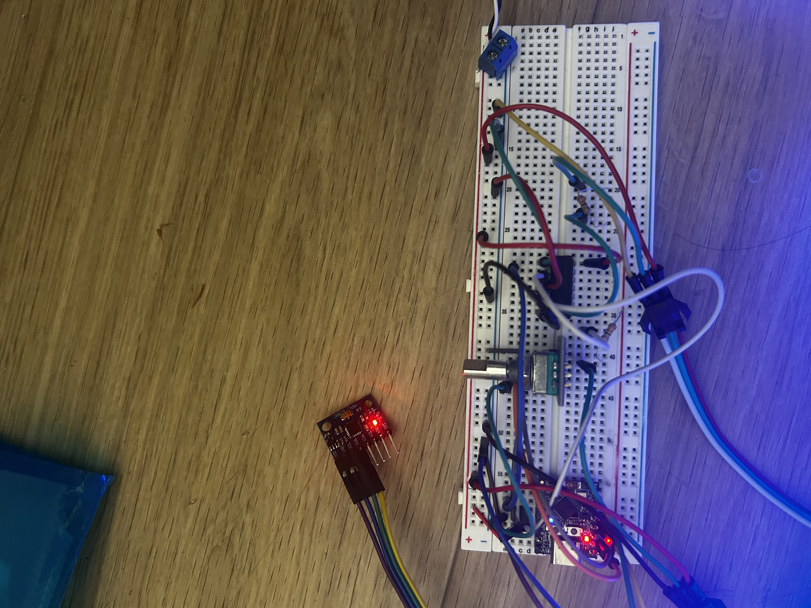
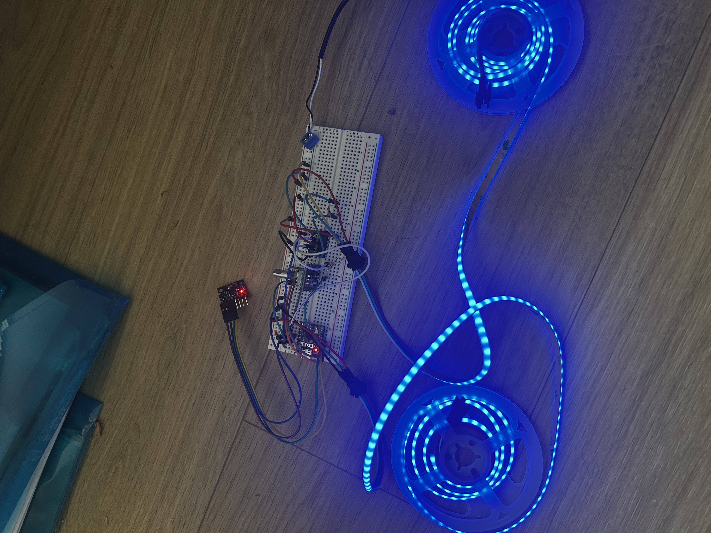
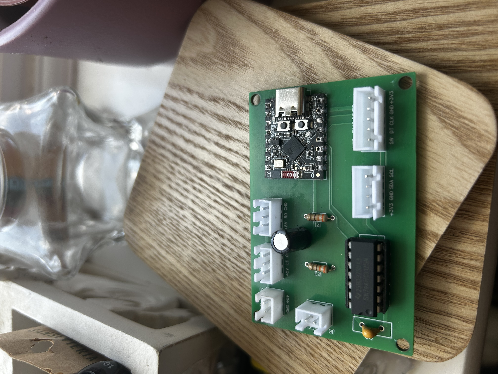

# Build Log

## Current Status

**Status:** Control box completed and functionally tested. Ready for temporary vehicle installation and real-world testing.

Completed:

- Hardware selection
- Hardware validation
- Breadboard prototype
- Firmware development
- PCB design
- PCB manufacture
- Initial PCB assembly and testing
- GPIO4 fault investigation
- Replacement PCB assembly
- Replacement PCB validation
- Control box construction
- PCB installation into control box
- Buck converter installation
- Control box functional testing

Next steps:

- Temporarily install the control box in the MR2
- Connect the vehicle 12V supply through the buck converter
- Verify buck converter output
- Mount the MPU6050 accelerometer in its final vehicle orientation
- Test the system under real driving conditions
- Adjust sensitivity and filtering if required
- Complete permanent installation into MR2

## Stage 1 — Planning

Created the initial GitHub repository and documented the project plan.

The original concept included GPS/OLED speed display functionality. The project scope was refined into an accelerometer-based reactive LED system to improve reliability, reduce complexity, and focus on vehicle dynamics.

Version 1 will use:

- ESP32-C3 Super Mini
- MPU6050 / GY-521 accelerometer
- WS2812B addressable LED strip
- SN74AHCT125N level shifter
- Rotary encoder
- 12V to 5V buck converter
- Fused power from the cigarette lighter circuit
- Gebildet Metal Toggle Switch
- Custom EasyEDA PCB with JST-XH connectors

**Status:** Complete — Project scope defined and initial system architecture established.

## Stage 2 — Parts Ordered

The complete system bill of materials was finalised and components were ordered.

The full project BOM is available here:

[System BOM](../hardware/bom/MR2_Reactive_LEDs_System_BOM.xlsx)

Ordered components:

- ESP32-C3 Super Mini
- MPU6050 / GY-521 accelerometer
- 2 × 1m WS2812B addressable LED strips
- SN74AHCT125N level shifter
- Rotary encoder
- 12V to 5V buck converter
- Inline fuse holder
- JST-XH connector kit
- 18AWG red/black wire
- 24AWG wire in various colours
- VHB mounting tape
- Gebildet Metal Toggle Switch
- 2-pin Waterproof Automotive Connector

**Status:** Complete — Required project hardware selected and ordered.

## Stage 3 — Bench Testing Plan

The first bench tests will focus on proving each part of the system works before building the final control box or installing anything in the car.

### Test 1 — Rotary Encoder + LEDs

Goal: confirm that the ESP32-C3 can read the rotary encoder and control the WS2812B LED strips through the SN74AHCT125N level shifter.

Planned behaviour:

- Encoder rotation adjusts LED brightness
- Encoder button changes LED mode
- LEDs receive data through the SN74AHCT125N level shifter
- Test one LED strip first, then both left and right outputs

### Test 2 — Add Accelerometer

Goal: add MPU6050 accelerometer input once the LED and encoder system is working.

Planned behaviour:

- Acceleration increases LED brightness/intensity
- Braking triggers a red pulse
- Cornering creates left/right LED effects

### Test 3 — Full Bench System

Goal: test the complete system outside the car before building the final control box.

Planned setup:

- ESP32-C3
- SN74AHCT125N level shifter
- Rotary encoder
- MPU6050
- Left and right LED strips
- 5V power supply or buck converter

**Status:** Complete — Bench testing plan defined and subsequently carried out in Stage 4.

## Stage 4 — Bench Testing Results

Bench testing results will be recorded here as each test is completed.

### Test 1 — Rotary Encoder + LEDs

**Date:** 15/07/26  
**Status:** Done

**Setup:**

- ESP32-C3 powered by USB
- Rotary encoder connected to ESP32-C3
- WS2812B LED strip connected through SN74AHCT125N level shifter
- LED strip powered from 5V supply

**Goal:**

Confirm that the rotary encoder can control LED brightness and modes.

**Result:**

Pass.

**Notes:**

- The SN74AHCT125N correctly shifted the 3.3V data signal to 5V.
- Brightness adjustment responded smoothly throughout the configured range.
- Encoder button reliably cycled through all four LED modes.
- No wiring faults or unexpected behaviour were observed.
- Test confirms the ESP32-C3, rotary encoder, level shifter and LED strip are functioning correctly and are ready for accelerometer integration in Test 2.

### Test 2 — Add Accelerometer

**Date:** 16/07/26  
**Status:** Done

**Setup:**

- ESP32-C3
- MPU6050 / GY-521 accelerometer
- Rotary encoder
- WS2812B LED strip
- SN74AHCT125N level shifter

**Goal:**

Confirm that acceleration, braking, and cornering inputs can affect the LED behaviour.

**Result:**

Pass.

The MPU6050 communicated successfully with the ESP32-C3 over I²C. All four firmware modes operated as expected, with LED colours and brightness responding correctly to changes in accelerometer orientation and movement.

**Notes:**

- Initial communication with the MPU6050 was unreliable due to poor solder joints on the ESP32-C3 header pins.
- After reflowing the solder joints, I²C communication became stable and the accelerometer was detected successfully.
- MPU6050 initialised successfully with no further communication errors.
- Longitudinal axis (X) correctly distinguished acceleration and braking.
- Lateral axis (Y) correctly detected left and right movement.
- Mode 1 accurately displayed acceleration (orange), braking (red), and stationary (blue).
- Mode 2 accurately displayed left movement (green), right movement (purple), and stationary (blue).
- Mode 3 correctly varied white LED brightness based on movement intensity.
- Sensor orientation matched the expected vehicle mounting direction.
- Bench testing confirmed correct accelerometer operation prior to vehicle installation.

### Test 3 — Full System Breadboard Test

**Date:** 16/07/26
**Status:** Done

**Setup:**

- ESP32-C3
- MPU6050
- Rotary encoder
- Left and right WS2812B LED strips
- SN74AHCT125N level shifter
- Breadboard prototype
- USB power

**Goal:**

Confirm that the complete hardware system operates correctly before manufacturing the custom PCB.

### Test 3 Photos

Photos documenting the completed breadboard prototype for test 3.

**Result:**

Pass.

The complete system operated successfully on a breadboard. All hardware components communicated correctly and the firmware responded as expected to simulated vehicle movement.

**Notes:**

- Left and right LED strips operated independently.
- Rotary encoder correctly adjusted brightness.
- Accelerometer correctly detected acceleration, braking and cornering.
- Breadboard prototype validated the final hardware design before PCB manufacture.
- Firmware architecture was successfully validated prior to PCB assembly.

**Status:** Complete — All planned bench tests passed and the complete breadboard prototype successfully validated the system hardware and firmware architecture before PCB manufacture.

## Stage 5 — PCB Design

Designed a custom PCB in EasyEDA to replace the breadboard prototype.

The PCB integrates:

- ESP32-C3 Super Mini
- SN74AHCT125N level shifter
- JST-XH connectors
- Power input connector
- Toggle switch connector
- Left and right LED outputs
- MPU6050 connector
- Rotary encoder connector
- Decoupling capacitors
- Mounting holes

The design was verified against the breadboard prototype before ordering.

Detailed PCB documentation, including schematics, PCB layout, and 3D renders:

[PCB Design Documentation](pcb-design.md)

**Status:** Complete

**Notes:**

- Two-layer FR4 PCB designed in EasyEDA.
- All power and signal routing completed.
- PCB passed ERC and DRC checks.
- Gerber files generated and submitted to JLCPCB for manufacture.
- Manufactured PCBs were received and progressed to Stage 7 for assembly and validation.

## Stage 6 — Firmware Development

Following successful hardware validation, the firmware underwent several major revisions to improve driving behaviour and user experience.

Early key improvements (v1.0–v3.2), completed before PCB assembly:

- Dynamic baseline filtering for hill compensation.
- Improved colour blending.
- Startup animation.
- Idle breathing effect.
- Solid colour modes.
- Removal of diagnostic operating modes.

**Firmware development did not stop once the PCB and control box were built.** Versions v3.3 through v3.7 were developed and refined *after* Stage 7 (PCB assembly and control box construction) was already complete, running in parallel with — and continuing past — the hardware build. This section originally implied firmware was finished before PCB work began; that wasn't the case in practice, and is corrected here for an accurate build timeline.

That later work, in brief (full detail in the firmware changelog):

- v3.3–v3.4: rotary encoder reliability and responsiveness fixes, moving to interrupt-driven quadrature decoding.
- v3.5: LED brightness/colour handling reworked to manual RGB channel scaling for more consistent colour at all brightness levels.
- v3.6: accelerometer-only "smart" hill-compensation baseline with a STABLE/DYNAMIC/SETTLING state machine.
- v3.7: hill compensation redesigned around gyroscope + accelerometer sensor fusion, replacing the accelerometer-only approach for the forward axis; multiple bench-testing fixes (gyro bias correction, accelerometer reliability gating, sign tuning, side-axis gating rework) refined during this stage.

See [firmware/README.md](../firmware/README.md) for the complete, detailed firmware version history.

**Status:** Complete for the version currently installed for vehicle testing (v3.7) — see Stage 8. Further firmware refinement is expected following real-world driving data, and will be added here and in the firmware changelog as it happens.

## Stage 7 — PCB Assembly and Control Box Development

Goal: assemble and verify the manufactured PCB, then transfer the PCB into a 'control box'.

### PCB Inspection and Initial Assembly

**Date:** 20/07/26

**Status:** Completed — Initial PCB assembly resulted in GPIO4 fault

The first manufactured PCB was received from JLCPCB and visually inspected before assembly.

Continuity testing was performed on the PCB before soldering components. All tested connections were found to be correct, with no unexpected shorts or open circuits identified.

The PCB was then fully assembled and all components were soldered in place.

Following assembly, the completed PCB was powered on and tested.

The following functions were successfully verified:

- ESP32-C3 powered correctly.
- WS2812B LED outputs operated correctly.
- SN74AHCT125N level shifter operated correctly.
- MPU6050 accelerometer communicated successfully.
- Accelerometer-based reactive lighting operated correctly.
- Rotary encoder button operated correctly for changing LED modes.
- Rotary encoder brightness adjustment did not operate correctly.

### GPIO4 Troubleshooting

Further testing was performed to identify the cause of the rotary encoder brightness adjustment failure.

The rotary encoder was connected using:

- GPIO4 — CLK
- GPIO5 — DT

GPIO5 operated correctly and responded to the rotary encoder as expected.

GPIO4, which was responsible for the encoder CLK signal, did not respond correctly.

Testing showed that:

- The physical GPIO4 signal was measured changing between approximately 0 V and 3.3 V when the encoder was rotated.
- GPIO4 did not respond correctly when read using `digitalRead(4)`.
- GPIO5 operated correctly using the same testing method.
- GPIO4 was tested using a simple software input test but continued to remain in an incorrect state.
- GPIO4 was also tested using a simple output test and did not behave as expected.
- GPIO7 was tested as an alternative GPIO for the encoder CLK signal and operated correctly.
- The rotary encoder itself was therefore confirmed to be functioning correctly.
- The PCB wiring and encoder circuit were also confirmed to be functional.

Further inspection suggested that the GPIO4 connection on the ESP32-C3 module may have been physically damaged or compromised during assembly. Solder was also found not to wet the suspected GPIO4 connection correctly.

### Resolution

As four additional manufactured PCBs were available from the original JLCPCB order, the decision was made to use a fresh PCB and a new ESP32-C3 Super Mini rather than continue troubleshooting the first assembled board.

The first PCB will be retained as a development and troubleshooting board.

The replacement PCB assembly was then tested progressively, beginning with the ESP32-C3 GPIOs and rotary encoder before completing the remaining hardware validation.

---

### Replacement PCB Assembly

**Date:** 22/07/26

**Status:** Completed

A replacement manufactured PCB was assembled using a new ESP32-C3 Super Mini.

The replacement PCB was visually inspected before assembly and continuity testing was performed to verify that the board was free from unexpected shorts or open connections.

The new ESP32-C3 Super Mini was soldered to the PCB and the board was tested before proceeding with the remaining hardware assembly.

The replacement PCB successfully passed initial testing.

The following functions were verified:

- ESP32-C3 powered correctly.
- GPIO4 operated correctly.
- GPIO5 operated correctly.
- Rotary encoder CLK and DT signals were detected correctly.
- Rotary encoder brightness adjustment operated correctly.
- Rotary encoder button operated correctly.
- WS2812B LED outputs operated correctly.
- SN74AHCT125N level shifter operated correctly.
- MPU6050 accelerometer communicated successfully.
- Accelerometer-based reactive lighting operated correctly.

The original GPIO4 issue was therefore isolated to the first ESP32-C3 assembly rather than the PCB design or rotary encoder circuit.

### Assembly Photos

Photos documenting the PCB assembly and testing process are available in the project image archive:

[PCB Assembly Photos](../images/pcb/)

---

### Control Box Construction

**Date:** 22/07/26

**Status:** Completed

The validated PCB was installed into a protective control box to provide a secure enclosure for the controller electronics and prepare the system for installation into the vehicle.

The control box houses the custom PCB, 12V to 5V buck converter, and connections for the vehicle power supply, LED strips, rotary encoder, MPU6050 accelerometer, and master power switch.

### Control Box Preparation

The enclosure was prepared for installation by:

- Marking the required mounting positions.
- Drilling mounting holes for the PCB.
- Drilling a cable entry point on the side of the enclosure.
- Installing a cable gland to protect and secure the external wiring.
- Checking internal clearance around the PCB, buck converter, and wiring.
- Preparing the enclosure to allow all external connections to be routed securely.

The enclosure was checked to ensure that all components and wiring could be installed without interference and that the lid could be securely closed.

### PCB Installation

The validated PCB was mounted securely inside the control box using two M3 screws.

The PCB was positioned to:

- Prevent contact between the PCB and the enclosure.
- Provide sufficient clearance around components.
- Allow access to external wiring connections.
- Keep wiring organised and secure.
- Prevent stress on the PCB or connectors when the enclosure was closed.

### Buck Converter Installation

The 12V to 5V buck converter was also installed inside the control box.

The buck converter provides the regulated 5V supply required by the PCB.

The converter was positioned inside the enclosure alongside the PCB, with sufficient clearance to prevent contact with other components and allow the wiring to be routed securely.

### External Connections

The external wiring was routed through a cable gland installed on the side of the control box.

The following external connections are routed from the control box:

- 12V vehicle power input
- Master power switch
- Left WS2812B LED strip
- Right WS2812B LED strip
- Rotary encoder
- MPU6050 accelerometer

The cable gland provides strain relief and protects the wiring where it enters and exits the enclosure.

The wiring was routed and secured to prevent unnecessary movement or strain on the PCB and component connections.

### Control Box Testing

**Date:** 22/07/26

**Status:** Completed — Passed

After the PCB and buck converter were installed inside the enclosure, the completed control box was tested using a temporary regulated 5V power supply.

The following functions were verified:

- ESP32-C3 powered correctly.
- Rotary encoder operation was confirmed.
- Rotary encoder brightness adjustment operated correctly.
- Rotary encoder button operated correctly.
- WS2812B LED outputs operated correctly.
- SN74AHCT125N level shifter operated correctly.
- MPU6050 communication was confirmed.
- Accelerometer-based reactive lighting operated correctly.
- The completed enclosure operated correctly with all components installed.

**Result:**

The completed control box successfully passed functional testing using a temporary regulated 5V supply. All major system functions operated correctly after the PCB and buck converter were installed inside the enclosure.

The 12V to 5V buck converter is installed inside the control box but will be fully tested during vehicle installation once connected to the vehicle's 12V supply.

The control box is now ready for temporary vehicle installation and real-world testing.

**Notes:**

- PCB mounted using two M3 screws.
- 12V to 5V buck converter mounted inside the enclosure, using two M3 screws.
- External wiring routed through a cable gland installed on the side of the enclosure.
- System testing was performed using a temporary regulated 5V supply.
- Buck converter operation from the vehicle's 12V supply will be verified during vehicle installation.

### Control Box Photos

Photos documenting the control box construction, PCB installation, buck converter installation, wiring, and completed enclosure are included below.

*(Photo links below are placeholders — images not yet uploaded to the repository.)*

**Notes:**

- The custom PCB was securely mounted inside the enclosure using two M3 screws.
- The 12V to 5V buck converter was mounted inside the enclosure alongside the PCB.
- External wiring was routed through a cable gland installed on the side of the enclosure.
- The completed control box was tested using a temporary regulated 5V power supply and all major system functions operated correctly.
- The buck converter will be tested using the vehicle's 12V supply during vehicle installation.
- The completed control box is ready for temporary vehicle installation and real-world testing.

### Stage 7 Summary

The first manufactured PCB was fully assembled and successfully passed initial functional testing except for rotary encoder brightness adjustment. Systematic testing isolated the issue to GPIO4 on the first ESP32-C3 module, with GPIO5 and GPIO7 confirmed to operate correctly.

A replacement PCB and new ESP32-C3 Super Mini were subsequently assembled. The replacement system successfully passed testing, including GPIO4, GPIO5, rotary encoder operation, LED outputs, level shifting, and MPU6050 communication.

The validated PCB was installed into the completed control box alongside the 12V to 5V buck converter. The completed enclosure was functionally tested using a temporary regulated 5V supply, with all major system functions operating correctly.

The control box is now ready for temporary vehicle installation. The buck converter will be tested using the vehicle's 12V supply during Stage 8, followed by real-world testing of the reactive lighting system.

**Note:** firmware development continued after this stage was completed — see Stage 6 above. The firmware installed for Stage 8 testing (v3.7) was developed after the control box shown here was already built.

**Status:** Complete — PCB validated, control box completed and functionally tested. Ready for Stage 8 vehicle testing.
  
## Stage 8 — Vehicle Testing

Goal: validate the completed system in the MR2 before permanently mounting the control box and LED components.

The completed control box will be temporarily installed in the MR2 to verify the buck converter, vehicle power connection, accelerometer orientation, and reactive lighting behaviour under real driving conditions.

**Firmware version under test:** v3.7 (gyroscope + accelerometer sensor fusion hill compensation). Developed and bench-tested after the control box (Stage 7) was already built — see Stage 6 and [firmware/README.md](../firmware/README.md) for full details of what changed and what's still unverified pending this real-world test.

Planned work:

- Temporarily install the control box in the MR2
- Connect the vehicle 12V supply to the control box
- Verify the 12V to 5V buck converter output
- Verify the system powers on and off correctly
- Mount the MPU6050 accelerometer in its final vehicle orientation
- Test startup sequence
- Test acceleration response
- Test braking response
- Test left/right cornering effects
- Verify rotary encoder brightness adjustment
- Verify LED strip operation
- Adjust sensitivity and filtering if required
- Verify behaviour during real driving conditions
- Specifically check: hill/gradient behaviour (v3.7's main change), sustained cornering brightness (recently patched, unverified), and road bump/surface noise sensitivity (untested, flagged as a risk in the firmware changelog)

**Status:** Pending

**Testing notes:**

Pending.

## Stage 9 — Final Installation

Goal: permanently install the validated reactive LED system into the MR2 following successful vehicle testing.

Planned work:

- Permanently mount the control box behind the centre dash
- Secure the PCB enclosure
- Connect the fused 12V vehicle power supply
- Permanently install the rotary encoder
- Permanently install the master toggle switch
- Permanently install the LED strips
- Mount the MPU6050 accelerometer securely in its final orientation
- Route and secure all wiring
- Complete final system test

**Status:** Pending

**Installation notes:**

Pending.
