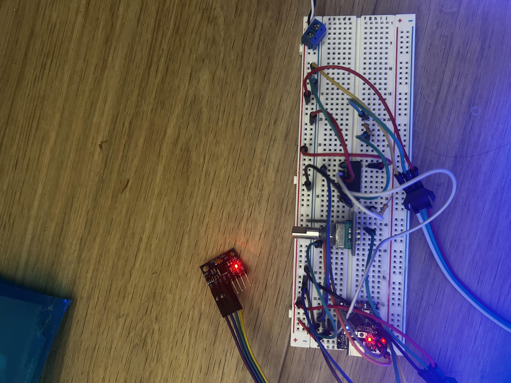
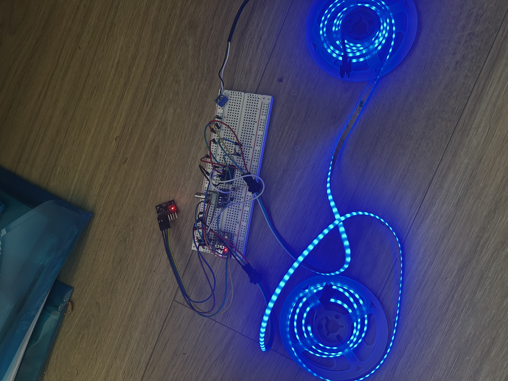
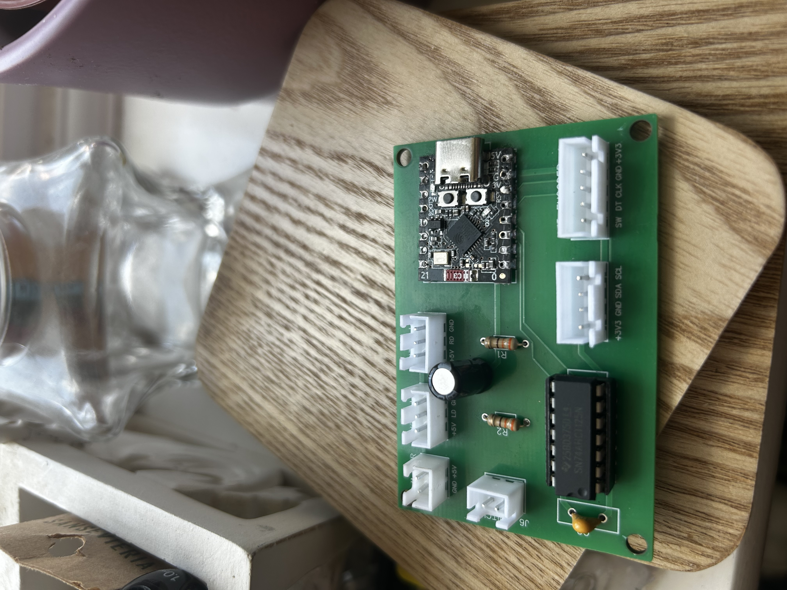
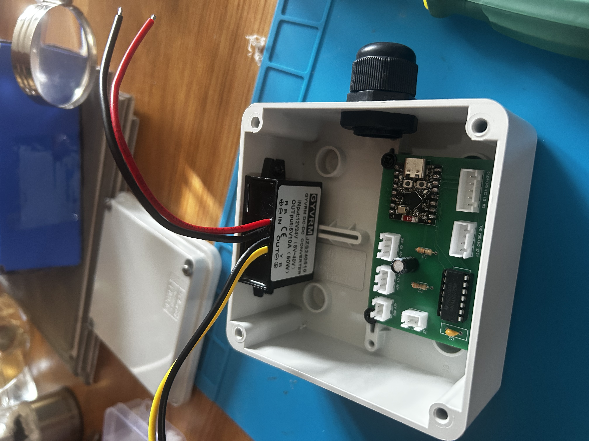

# Build Log

## Current Status

**Status:** Core project complete and confirmed. Physical installation is complete — control box, accelerometer (under the shift boot leather), rotary encoder (hole drilled into the dash trim), and LED strips (footwells) are all mounted in their final positions, running on actual vehicle power (12V from the cigarette lighter circuit, fused and spliced). Rotary encoder brightness adjustment and LED strip output were confirmed working correctly in the car at this initial installation. The original buck converter was replaced with a repurposed USB charger module after it caused intermittent cold-boot failures — repeated cold-boot testing since confirms the replacement works reliably every time. A minor USB-power backfeed to the car's radio circuit, and a barely-noticeable audio noise through the speakers, were both found and deliberately left unfixed — see Stage 8 for reasoning. Master power switch omitted from the build. **v2.4.1 is the final firmware version, confirmed on real driving** — the downhill red/blue flicker found on v2.3 (traced to v2.2's acceleration-hold tuning, not an inherent accelerometer-only limitation as first believed) is resolved. v2.4.0, a first attempt at this fix, made no difference — it only fixed one of two coupled accelerometer axes; v2.4.1 fixes the second, and the next drive confirmed it worked. The parallel gyroscope-based v3.0/v3.1 branch is parked and not being pursued further. **With this confirmed, active work has moved to the [audio-reactive LED addition](audio-reactive-led-plan.md)** — see the dedicated section below.

Completed:

- Hardware selection
- Hardware validation
- Breadboard prototype
- Firmware development
- PCB design
- PCB manufacture
- Initial PCB assembly and testing
- GPIO4 fault investigation
- Replacement PCB assembly
- Replacement PCB validation
- Control box construction
- PCB installation into control box
- Control box functional testing
- Control box installed in the MR2
- MPU6050 accelerometer mounted in final orientation, under the shift boot leather
- Rotary encoder mounted, with a hole drilled into the dash trim to fit it
- LED strips installed in the footwells
- Buck converter replaced with a USB charger module
- Vehicle 12V power connected (cigarette lighter circuit, fused, Wago-spliced)
- All physical installation complete — see Stage 9
- Several real-world test drives (v3.0 logged; v2.0, v2.1, v2.2, v2.3, v3.1 visual-only) — see Stage 8
- v2.1 confirmed as a genuinely clean, working baseline
- v2.2 drive-tested — works well, with two known limitations (higher gears rarely reach orange; steep downhill braking over-triggers)
- v2.3 built (higher-gear acceleration tuning), then code-reviewed before its first drive — fixed a genuine bug (Modes 1-4 had silently stopped reacting to movement) plus a moving-vehicle recalibration guard and dead-code/duplication cleanup
- v2.3 drive-tested: works well overall, higher gears now reach orange, Modes 1-4 confirmed noticeably livelier. One new issue found — flickering between red and blue going downhill, not present on earlier versions
- Flicker root-caused to v2.1 → v2.2's `gravitySmoothing`/`baselineDynamicReentryThreshold` tuning (made to help acceleration hold its colour), not an inherent accelerometer-only limitation as first believed
- v2.4.0 built: splits `gravitySmoothing` by direction (accelerating vs braking/downhill) so hills settle quickly again without giving back the acceleration-hold improvement
- v2.4.0 drive-tested: no improvement — downhill flicker unchanged. Root cause found: only the forward axis (`gravityX`) was fixed; a hill pitch also shifts the vertical axis (`gravityZ`), which was left on the old slow rate and dominated the combined gating signal regardless
- v2.4.1 built: extends the same direction-aware rate to `gravityZ`
- v2.4.1 drive-tested and **confirmed: the downhill flicker is gone**, acceleration-hold and braking both feel unchanged
- **v2.4.1 confirmed as the final firmware version — core project complete**

Next steps:

- None for the core project — it's finished. Active work has moved to the [audio-reactive LED addition](audio-reactive-led-plan.md), currently early in Phase 2 (bench testing). v3.0/v3.1's gyroscope approach remains parked, not being pursued further.

## Stage 1 — Planning

Created the initial GitHub repository and documented the project plan.

The original concept included GPS/OLED speed display functionality. The project scope was refined into an accelerometer-based reactive LED system to improve reliability, reduce complexity, and focus on vehicle dynamics.

Version 1 will use:

- ESP32-C3 Super Mini
- MPU6050 / GY-521 accelerometer
- WS2812B addressable LED strip
- SN74AHCT125N level shifter
- Rotary encoder
- 12V to 5V buck converter
- Fused power from the cigarette lighter circuit
- Gebildet Metal Toggle Switch
- Custom EasyEDA PCB with JST-XH connectors

**Status:** Complete — Project scope defined and initial system architecture established.

## Stage 2 — Parts Ordered

The complete system bill of materials was finalised and components were ordered.

The full project BOM is available here:

[System BOM](../hardware/bom/MR2_Reactive_LEDs_System_BOM.xlsx)

Ordered components:

- ESP32-C3 Super Mini
- MPU6050 / GY-521 accelerometer
- 2 × 1m WS2812B addressable LED strips
- SN74AHCT125N level shifter
- Rotary encoder
- 12V to 5V buck converter
- Inline fuse holder
- JST-XH connector kit
- 18AWG red/black wire
- 24AWG wire in various colours
- VHB mounting tape
- Gebildet Metal Toggle Switch
- 2-pin Waterproof Automotive Connector

**Status:** Complete — Required project hardware selected and ordered.

## Stage 3 — Bench Testing Plan

The first bench tests will focus on proving each part of the system works before building the final control box or installing anything in the car.

### Test 1 — Rotary Encoder + LEDs

Goal: confirm that the ESP32-C3 can read the rotary encoder and control the WS2812B LED strips through the SN74AHCT125N level shifter.

Planned behaviour:

- Encoder rotation adjusts LED brightness
- Encoder button changes LED mode
- LEDs receive data through the SN74AHCT125N level shifter
- Test one LED strip first, then both left and right outputs

### Test 2 — Add Accelerometer

Goal: add MPU6050 accelerometer input once the LED and encoder system is working.

Planned behaviour:

- Acceleration increases LED brightness/intensity
- Braking triggers a red pulse
- Cornering creates left/right LED effects

### Test 3 — Full Bench System

Goal: test the complete system outside the car before building the final control box.

Planned setup:

- ESP32-C3
- SN74AHCT125N level shifter
- Rotary encoder
- MPU6050
- Left and right LED strips
- 5V power supply or buck converter

**Status:** Complete — Bench testing plan defined and subsequently carried out in Stage 4.

## Stage 4 — Bench Testing Results

Bench testing results will be recorded here as each test is completed.

### Test 1 — Rotary Encoder + LEDs

**Date:** 15/07/26  
**Status:** Done

**Setup:**

- ESP32-C3 powered by USB
- Rotary encoder connected to ESP32-C3
- WS2812B LED strip connected through SN74AHCT125N level shifter
- LED strip powered from 5V supply

**Goal:**

Confirm that the rotary encoder can control LED brightness and modes.

**Result:**

Pass.

**Notes:**

- The SN74AHCT125N correctly shifted the 3.3V data signal to 5V.
- Brightness adjustment responded smoothly throughout the configured range.
- Encoder button reliably cycled through all four LED modes.
- No wiring faults or unexpected behaviour were observed.
- Test confirms the ESP32-C3, rotary encoder, level shifter and LED strip are functioning correctly and are ready for accelerometer integration in Test 2.

### Test 2 — Add Accelerometer

**Date:** 16/07/26  
**Status:** Done

**Setup:**

- ESP32-C3
- MPU6050 / GY-521 accelerometer
- Rotary encoder
- WS2812B LED strip
- SN74AHCT125N level shifter

**Goal:**

Confirm that acceleration, braking, and cornering inputs can affect the LED behaviour.

**Result:**

Pass.

The MPU6050 communicated successfully with the ESP32-C3 over I²C. All four firmware modes operated as expected, with LED colours and brightness responding correctly to changes in accelerometer orientation and movement.

**Notes:**

- Initial communication with the MPU6050 was unreliable due to poor solder joints on the ESP32-C3 header pins.
- After reflowing the solder joints, I²C communication became stable and the accelerometer was detected successfully.
- MPU6050 initialised successfully with no further communication errors.
- Longitudinal axis (X) correctly distinguished acceleration and braking.
- Lateral axis (Y) correctly detected left and right movement.
- Mode 1 accurately displayed acceleration (orange), braking (red), and stationary (blue).
- Mode 2 accurately displayed left movement (green), right movement (purple), and stationary (blue).
- Mode 3 correctly varied white LED brightness based on movement intensity.
- Sensor orientation matched the expected vehicle mounting direction.
- Bench testing confirmed correct accelerometer operation prior to vehicle installation.

### Test 3 — Full System Breadboard Test

**Date:** 16/07/26
**Status:** Done

**Setup:**

- ESP32-C3
- MPU6050
- Rotary encoder
- Left and right WS2812B LED strips
- SN74AHCT125N level shifter
- Breadboard prototype
- USB power

**Goal:**

Confirm that the complete hardware system operates correctly before manufacturing the custom PCB.

### Test 3 Photos

Photos documenting the completed breadboard prototype for test 3.

**Result:**

Pass.

The complete system operated successfully on a breadboard. All hardware components communicated correctly and the firmware responded as expected to simulated vehicle movement.

**Notes:**

- Left and right LED strips operated independently.
- Rotary encoder correctly adjusted brightness.
- Accelerometer correctly detected acceleration, braking and cornering.
- Breadboard prototype validated the final hardware design before PCB manufacture.
- Firmware architecture was successfully validated prior to PCB assembly.

**Status:** Complete — All planned bench tests passed and the complete breadboard prototype successfully validated the system hardware and firmware architecture before PCB manufacture.

## Stage 5 — PCB Design

Designed a custom PCB in EasyEDA to replace the breadboard prototype.

The PCB integrates:

- ESP32-C3 Super Mini
- SN74AHCT125N level shifter
- JST-XH connectors
- Power input connector
- Toggle switch connector
- Left and right LED outputs
- MPU6050 connector
- Rotary encoder connector
- Decoupling capacitors
- Mounting holes

The design was verified against the breadboard prototype before ordering.

Detailed PCB documentation, including schematics, PCB layout, and 3D renders:

[PCB Design Documentation](pcb-design.md)

**Status:** Complete

**Notes:**

- Two-layer FR4 PCB designed in EasyEDA.
- All power and signal routing completed.
- PCB passed ERC and DRC checks.
- Gerber files generated and submitted to JLCPCB for manufacture.
- Manufactured PCBs were received and progressed to Stage 7 for assembly and validation.

## Stage 6 — Firmware Development

Following successful hardware validation, the firmware underwent several major revisions to improve driving behaviour and user experience.

Early key improvements (v1.0–v1.4), completed before PCB assembly:

- Dynamic baseline filtering for hill compensation.
- Improved colour blending.
- Startup animation.
- Idle breathing effect.
- Solid colour modes.
- Removal of diagnostic operating modes.

**Firmware development did not stop once the PCB and control box were built.** Versions v1.5 through v3.0 were developed and refined *after* Stage 7 (PCB assembly and control box construction) was already complete, running in parallel with — and continuing past — the hardware build. This section originally implied firmware was finished before PCB work began; that wasn't the case in practice, and is corrected here for an accurate build timeline.

That later work, in brief (full detail in the firmware changelog):

- v1.5–v1.6: rotary encoder reliability and responsiveness fixes, moving to interrupt-driven quadrature decoding.
- v1.7: LED brightness/colour handling reworked to manual RGB channel scaling for more consistent colour at all brightness levels.
- v2.0: accelerometer-only "smart" hill-compensation baseline with a STABLE/DYNAMIC/SETTLING state machine.
- v3.0: hill compensation redesigned around gyroscope + accelerometer sensor fusion, replacing the accelerometer-only approach for the forward axis; multiple bench-testing fixes (gyro bias correction, accelerometer reliability gating, sign tuning, side-axis gating rework) refined during this stage.

See [firmware/README.md](../firmware/README.md) for the complete, detailed firmware version history.

**Status:** Complete for the version currently installed for vehicle testing (v3.0) — see Stage 8. Further firmware refinement is expected following real-world driving data, and will be added here and in the firmware changelog as it happens.

## Stage 7 — PCB Assembly and Control Box Development

Goal: assemble and verify the manufactured PCB, then transfer the PCB into a 'control box'.

### PCB Inspection and Initial Assembly

**Date:** 20/07/26

**Status:** Completed — Initial PCB assembly resulted in GPIO4 fault

The first manufactured PCB was received from JLCPCB and visually inspected before assembly.

Continuity testing was performed on the PCB before soldering components. All tested connections were found to be correct, with no unexpected shorts or open circuits identified.

The PCB was then fully assembled and all components were soldered in place.

Following assembly, the completed PCB was powered on and tested.

The following functions were successfully verified:

- ESP32-C3 powered correctly.
- WS2812B LED outputs operated correctly.
- SN74AHCT125N level shifter operated correctly.
- MPU6050 accelerometer communicated successfully.
- Accelerometer-based reactive lighting operated correctly.
- Rotary encoder button operated correctly for changing LED modes.
- Rotary encoder brightness adjustment did not operate correctly.

### GPIO4 Troubleshooting

Further testing was performed to identify the cause of the rotary encoder brightness adjustment failure.

The rotary encoder was connected using:

- GPIO4 — CLK
- GPIO5 — DT

GPIO5 operated correctly and responded to the rotary encoder as expected.

GPIO4, which was responsible for the encoder CLK signal, did not respond correctly.

Testing showed that:

- The physical GPIO4 signal was measured changing between approximately 0 V and 3.3 V when the encoder was rotated.
- GPIO4 did not respond correctly when read using `digitalRead(4)`.
- GPIO5 operated correctly using the same testing method.
- GPIO4 was tested using a simple software input test but continued to remain in an incorrect state.
- GPIO4 was also tested using a simple output test and did not behave as expected.
- GPIO7 was tested as an alternative GPIO for the encoder CLK signal and operated correctly.
- The rotary encoder itself was therefore confirmed to be functioning correctly.
- The PCB wiring and encoder circuit were also confirmed to be functional.

Further inspection suggested that the GPIO4 connection on the ESP32-C3 module may have been physically damaged or compromised during assembly. Solder was also found not to wet the suspected GPIO4 connection correctly.

### Resolution

As four additional manufactured PCBs were available from the original JLCPCB order, the decision was made to use a fresh PCB and a new ESP32-C3 Super Mini rather than continue troubleshooting the first assembled board.

The first PCB will be retained as a development and troubleshooting board.

The replacement PCB assembly was then tested progressively, beginning with the ESP32-C3 GPIOs and rotary encoder before completing the remaining hardware validation.

---

### Replacement PCB Assembly

**Date:** 22/07/26

**Status:** Completed

A replacement manufactured PCB was assembled using a new ESP32-C3 Super Mini.

The replacement PCB was visually inspected before assembly and continuity testing was performed to verify that the board was free from unexpected shorts or open connections.

The new ESP32-C3 Super Mini was soldered to the PCB and the board was tested before proceeding with the remaining hardware assembly.

The replacement PCB successfully passed initial testing.

The following functions were verified:

- ESP32-C3 powered correctly.
- GPIO4 operated correctly.
- GPIO5 operated correctly.
- Rotary encoder CLK and DT signals were detected correctly.
- Rotary encoder brightness adjustment operated correctly.
- Rotary encoder button operated correctly.
- WS2812B LED outputs operated correctly.
- SN74AHCT125N level shifter operated correctly.
- MPU6050 accelerometer communicated successfully.
- Accelerometer-based reactive lighting operated correctly.

The original GPIO4 issue was therefore isolated to the first ESP32-C3 assembly rather than the PCB design or rotary encoder circuit.

### Assembly Photos

Photos documenting the PCB assembly and testing process are available in the project image archive:

[PCB Assembly Photos](../images/pcb/)

---

### Control Box Construction

**Date:** 22/07/26

**Status:** Completed

The validated PCB was installed into a protective control box to provide a secure enclosure for the controller electronics and prepare the system for installation into the vehicle.

The control box houses the custom PCB, 12V to 5V buck converter, and connections for the vehicle power supply, LED strips, rotary encoder, MPU6050 accelerometer, and master power switch.

### Control Box Preparation

The enclosure was prepared for installation by:

- Marking the required mounting positions.
- Drilling mounting holes for the PCB.
- Drilling a cable entry point on the side of the enclosure.
- Installing a cable gland to protect and secure the external wiring.
- Checking internal clearance around the PCB, buck converter, and wiring.
- Preparing the enclosure to allow all external connections to be routed securely.

The enclosure was checked to ensure that all components and wiring could be installed without interference and that the lid could be securely closed.

### PCB Installation

The validated PCB was mounted securely inside the control box using two M3 screws.

The PCB was positioned to:

- Prevent contact between the PCB and the enclosure.
- Provide sufficient clearance around components.
- Allow access to external wiring connections.
- Keep wiring organised and secure.
- Prevent stress on the PCB or connectors when the enclosure was closed.

### Buck Converter Installation

The 12V to 5V buck converter was also installed inside the control box.

The buck converter provides the regulated 5V supply required by the PCB.

The converter was positioned inside the enclosure alongside the PCB, with sufficient clearance to prevent contact with other components and allow the wiring to be routed securely.

### External Connections

The external wiring was routed through a cable gland installed on the side of the control box.

The following external connections are routed from the control box:

- 12V vehicle power input
- Master power switch
- Left WS2812B LED strip
- Right WS2812B LED strip
- Rotary encoder
- MPU6050 accelerometer

The cable gland provides strain relief and protects the wiring where it enters and exits the enclosure.

The wiring was routed and secured to prevent unnecessary movement or strain on the PCB and component connections.

### Control Box Testing

**Date:** 22/07/26

**Status:** Completed — Passed

After the PCB and buck converter were installed inside the enclosure, the completed control box was tested using a temporary regulated 5V power supply.

The following functions were verified:

- ESP32-C3 powered correctly.
- Rotary encoder operation was confirmed.
- Rotary encoder brightness adjustment operated correctly.
- Rotary encoder button operated correctly.
- WS2812B LED outputs operated correctly.
- SN74AHCT125N level shifter operated correctly.
- MPU6050 communication was confirmed.
- Accelerometer-based reactive lighting operated correctly.
- The completed enclosure operated correctly with all components installed.

**Result:**

The completed control box successfully passed functional testing using a temporary regulated 5V supply. All major system functions operated correctly after the PCB and buck converter were installed inside the enclosure.

The 12V to 5V buck converter is installed inside the control box but will be fully tested during vehicle installation once connected to the vehicle's 12V supply.

The control box is now ready for temporary vehicle installation and real-world testing.

**Notes:**

- PCB mounted using two M3 screws.
- 12V to 5V buck converter mounted inside the enclosure, using two M3 screws.
- External wiring routed through a cable gland installed on the side of the enclosure.
- System testing was performed using a temporary regulated 5V supply.
- Buck converter operation from the vehicle's 12V supply will be verified during vehicle installation.

### Control Box Photos

**Notes:**

- The custom PCB was securely mounted inside the enclosure using two M3 screws.
- The 12V to 5V buck converter was mounted inside the enclosure alongside the PCB.
- External wiring was routed through a cable gland installed on the side of the enclosure.
- The completed control box was tested using a temporary regulated 5V power supply and all major system functions operated correctly.
- The buck converter will be tested using the vehicle's 12V supply during vehicle installation.
- The completed control box is ready for temporary vehicle installation and real-world testing.

### Stage 7 Summary

The first manufactured PCB was fully assembled and successfully passed initial functional testing except for rotary encoder brightness adjustment. Systematic testing isolated the issue to GPIO4 on the first ESP32-C3 module, with GPIO5 and GPIO7 confirmed to operate correctly.

A replacement PCB and new ESP32-C3 Super Mini were subsequently assembled. The replacement system successfully passed testing, including GPIO4, GPIO5, rotary encoder operation, LED outputs, level shifting, and MPU6050 communication.

The validated PCB was installed into the completed control box alongside the 12V to 5V buck converter. The completed enclosure was functionally tested using a temporary regulated 5V supply, with all major system functions operating correctly.

The control box is now ready for temporary vehicle installation. The buck converter will be tested using the vehicle's 12V supply during Stage 8, followed by real-world testing of the reactive lighting system.

**Note:** firmware development continued after this stage was completed — see Stage 6 above. The firmware installed for Stage 8 testing (v3.0) was developed after the control box shown here was already built.

**Status:** Complete — PCB validated, control box completed and functionally tested. Ready for Stage 8 vehicle testing.
  
## Stage 8 — Vehicle Testing

Goal: validate the completed system in the MR2 before permanently mounting the control box and LED components.

The completed control box was installed in the MR2 to verify vehicle power connection, accelerometer orientation, and reactive lighting behaviour under real driving conditions — including validating the buck converter originally installed for this, which was subsequently replaced (see Build Change entries below).

**Firmware version tested:** v3.0 (gyroscope + accelerometer sensor fusion) and v2.0 (accelerometer-only smart baseline), both tested in real driving — see "Test Drive Results" below. Currently active version is **v2.1**, a field-tuned branch of v2.0 — see [firmware/README.md](../firmware/README.md) for the full version history and why development moved to v2.1 rather than continuing v3.0.

### Build Change: Master Power Switch Removed

The Gebildet metal toggle switch specified in the original design was not fitted — insufficient mounting space was available at the intended location. The switch connector on the PCB has been shorted instead, so the system is now permanently live whenever it has power, with no separate physical on/off switch.

Practical effect: the system powers on/off by whatever connects/disconnects its power feed — the fused 12V vehicle supply via the power module (originally a buck converter, now a repurposed USB charger module — see Build Change entries below), or USB-C for bench/upload purposes — rather than a dedicated switch. This is a deliberate build simplification, not a firmware change — the switch was never read by the firmware, only ever a physical interrupt on the power line upstream of the board.

This affects the top-level project README (Features, Hardware table, System Behaviour table, Wiring Summary) and the wiring plan, both updated separately to match. It also affects Stage 9's planned work below.

### Build Change: LED Strips Cut to Fit Final Mounting

The two 1m/160-LED WS2812B strips originally specified were cut down to approximately 0.5m (80 LEDs) per side to fit the final footwell mounting.

Firmware updated to match: `NUM_LEDS_LEFT`/`NUM_LEDS_RIGHT` changed from `160` to `80`. Originally applied to v3.0 only; v2.0 retains the original `160` (it wasn't in active use when the strips were cut), but v2.1 has since had the same fix applied, since that's the version actually running in the car — see Test Drive Results below. This constant controls the pixel buffer size and, more importantly, the startup sweep animation's length — an unmatched count wouldn't damage anything, but would make that animation run for double its intended length before continuing to calibration. Static/reactive colour output (all five modes) sets every physical LED to the same colour, so it wasn't affected by the count either way. See [firmware/README.md](../firmware/README.md) for the code-level detail.

### Build Change: 12V to 5V Buck Converter Replaced with a Repurposed USB Charger Module

The original 12V to 5V buck converter specified in the design (see BOM) was replaced with a small USB car-charger module (disassembled from its housing) mounted inside the control box in its place.

**Why:** once wired into the car and powered via the cigarette lighter circuit, the system exhibited an intermittent cold-boot failure — the startup sweep would often not run, and sometimes not even the calibration flash would appear, though a manual replug of the power connector reliably fixed it once running. Extensive troubleshooting (documented in project chat history, not reproduced in full here) ruled out the fuse, the Wago splices, wire gauge, and the car's own wiring quality (confirmed via a working USB charger plugged into the same circuit) as causes, narrowing it down specifically to the buck converter module's power-up characteristics — most likely a slow or unclean voltage rise on cold start, which can cause an ESP32-C3 to read its strapping pins (including one shared with the I2C bus) incorrectly during boot. A bulk capacitor was tried first as a smaller intervention; it did not resolve the issue. A software I2C bus-recovery routine was also tried and later reverted, since the PCB's I2C pins (GPIO8/9) are fixed by the manufactured board and can't be reassigned, and the fix didn't reliably address a true boot-time strapping issue in any case.

**The fix:** a small USB phone-charger module was confirmed via bench testing (powered from an improvised 12V source, 9V + 2×1.5V AA batteries) to output a clean, stable ~5.2V with no boot issues across repeated cold cycles — commercial USB chargers use proper current-limited, soft-start regulation that the buck converter apparently lacked. The module was disassembled from its housing and mounted inside the control box in place of the buck converter, using the same 12V input (from the existing fuse/Wago splice) and 5V output wiring.

**Status:** Installed and powering the system from actual vehicle power. Repeated cold-boot testing since confirms the fix — the intermittent boot failure has not recurred, and the system now boots reliably every time.

This changes the top-level README, hardware table, wiring plan, and BOM, which described a buck converter; these are being updated separately to match. The buck converter component itself remains listed in the BOM as originally purchased, but is no longer used in the build.

### Build Change: USB Power Backfeed Discovered — Accepted, Not Fixed

While testing, it was discovered that connecting the board via USB-C (laptop power, key off) causes the car radio to power on. Root cause: the lighter and radio circuits share a common fuse/node downstream of the ignition switch, and the charger module (like most simple buck/charger modules) has no reverse-current blocking diode on its input — current from USB can flow backward through the module and out onto that shared circuit, powering anything else on it.

This does not reach the battery or cross the ignition switch (which remains a genuine open circuit with the key off), so it is not a drain or safety risk in that sense. It confirms the USB-power and vehicle-power paths are not fully isolated from each other, reinforcing the existing rule that both must never be connected to the board at the same time — key must be fully off any time USB-C is connected.

**Decision: not fixing this.** A blocking diode (Schottky, e.g. 1N5822) was identified as the correct fix, but given the impact is limited to "radio turns on while USB is connected with the key off" — not a safety or drain issue — it was judged not worth the added complexity. Documented here as a known, deliberate trade-off rather than an outstanding task.

### Note: Minor Audio Noise Through Speakers — Accepted, Not Investigated Further

A slight noise through the car speakers was noted when LED brightness changes, most audible when adjusting the encoder — in practice barely noticeable, if noticeable at all. This is a known, common characteristic of PWM-driven addressable LED strips (WS2812B) — the strips' own switching behaviour is electrically noisy, largely independent of which power module feeds them — so this was likely present in some form regardless of the buck-converter-to-charger-module change above.

**Decision: not worth further investigation.** Given how marginal the noise actually is, mitigations like ferrite chokes or moving the ground splice weren't pursued. Documented for completeness in case it becomes more noticeable in the future.

### Installation Progress

Completed so far:

- Control box installed in the MR2 — rotary encoder brightness adjustment and LED strip output confirmed working correctly in the car at this initial installation.
- MPU6050 accelerometer mounted in its final vehicle orientation, under the shift boot leather.
- Rotary encoder mounted, with a hole drilled into the dash trim to fit it.
- LED strips installed in the footwells (left and right).
- Master switch connector shorted (see above) in place of the physical switch.
- LED strips cut to final length (v3.0 firmware updated to match; see note above re: v2.1).
- Buck converter replaced with a USB charger module (see Build Change above).
- Vehicle 12V power connected via the cigarette lighter circuit (fused, Wago-spliced) — system now runs from actual vehicle power, not just USB/portable testing.
- Several real-world test drives completed across v3.0, v2.0, v2.1, v2.2, and v2.3 (see Test Drive Results below).
- v2.1 confirmed as a genuinely clean baseline (tuned acceleration response + LED count, no other changes) after an earlier documentation mix-up was caught and corrected.
- v2.2 drive-tested: further tuning pass on top of v2.1, targeting the sustained-acceleration fade issue. Works well overall; two limitations found (higher gears rarely reach orange, steep downhill braking over-triggers) — see Test Drive Results below.
- v2.3 built: addresses the higher-gear acceleration issue found on v2.2. Code-reviewed before its first drive, fixing a genuine bug (Modes 1-4 had silently stopped reacting to movement) and some robustness cleanup — see Test Drive Results below.
- v2.3 drive-tested: works well overall, but found a new issue not present on earlier versions — flickering between red and blue going downhill.
- Flicker traced to v2.1 → v2.2's `gravitySmoothing`/`baselineDynamicReentryThreshold` tuning (made to help acceleration hold its colour longer), not an inherent accelerometer-only limitation as first assumed.
- v2.4.0 built: splits `gravitySmoothing` by direction (accelerating vs braking/downhill) so hills settle quickly again, without giving back the acceleration-hold improvement — see Test Drive Results below.
- v2.4.0 drive-tested: no improvement — downhill flicker unchanged, uphill and flat unchanged (both already fine). Root cause: this fix only made the forward axis (`gravityX`) direction-aware; a hill pitch also shifts the vertical axis (`gravityZ`) at the same time, which was left on the old slow rate and dominated the combined gating signal regardless.
- v2.4.1 built: extends the same direction-aware rate to `gravityZ` as well — see Test Drive Results below.
- v2.4.1 drive-tested: **confirmed — the downhill flicker is gone**, acceleration-hold and braking both feel unchanged from v2.2/v2.3.
- Repeated cold-boot testing on vehicle power with the new charger module — confirmed reliable every time, resolving the intermittent boot issue.

**All physical installation is complete** — control box, accelerometer, encoder, and LED strips are all mounted in their final positions, and the system runs on actual vehicle power. **v2.4.1 is confirmed as the final firmware version — the core project is finished.** It resolved the flicker found on v2.3 (v2.4.0 was a first attempt that didn't work). See Stage 9 below; the original plan assumed a separate "temporary test install, then permanent install" split that didn't end up matching how the build actually happened.

Not pursued further:

- v3.0/v3.1's gyroscope + accelerometer sensor fusion (tuned acceleration response, plus a lowered `pitchComplementaryAlpha`) tested once — found to fade even faster than v2.1 during sustained acceleration, and left an unresolved question of whether the gyro absorbs genuine acceleration as if it were a hill. Documented as a deliberately parked, not-pursued-further branch — the same accelerometer-only line (v2.x) reached a good enough result via v2.4.1 that this wasn't needed to finish the project.

### Test Drive Results

**Drive 1 (v3.0, Serial-logged):** Cornering worked well. Braking was responsive, including correctly triggering on hills. Acceleration rarely reached true orange — logged data showed hard acceleration peaking around 0.17g against a 0.35g target, meaning even a hard launch only reached partway through the colour transition. Pitch estimate showed large swings during acceleration (double-digit degrees) — possibly the gyro absorbing genuine acceleration as a hill, possibly genuine road gradient; not confirmed either way, as the run wasn't verified to be on flat ground.

**Drive 2 (v2.0, visual check only):** Braking and cornering worked well, including correctly triggering red while braking downhill. A real hill, driven at steady speed, correctly settled to blue. Acceleration had the same rarely-reaches-orange issue as v3.0 — confirming it as a shared tuning problem, not specific to either hill-compensation approach. One difference from v3.0: braking didn't trigger on upshifts (v3.0 did) — see firmware changelog for the likely explanation.

**Decision:** development moved to tuning v2.0 (now v2.1) rather than continuing v3.0 immediately, based on v2.0's clean real-world result versus v3.0's unresolved pitch-drift question. This is provisional — v3.0 is not considered abandoned, and may be revisited once its pitch behaviour can be tested unambiguously (hard acceleration on confirmed-flat ground). See the firmware changelog's v2.1 entry for the full reasoning.

**v2.1 fixes applied and confirmed:** `accelerationResponseG` lowered from `0.35` to `0.18` based on the logged 0.17g data point. `NUM_LEDS_LEFT`/`NUM_LEDS_RIGHT` updated from `160` to `80` to match the cut strips. Braking and cornering confirmed working well on real drives. Acceleration confirmed to reach orange correctly with the tuned value, though found to fade prematurely on a sufficiently long, sustained pull — a distinct issue from the tuning fix itself, addressed below.

**Drive 3 (v3.1, visual check only):** v3.0 with the same acceleration tuning ported across, plus `pitchComplementaryAlpha` lowered from `0.98` to `0.90`. Braking worked well. Acceleration briefly reached orange only under hard 1st-gear launches, fading back to blue in under a second even while still accelerating — faster than v2.1's fade, not slower. This matches the timing of the pitch drift seen in the original v3.0 log closely enough to strongly suggest the gyro is absorbing genuine acceleration as if it were a hill, rather than this being a road-gradient artefact. v3.1 is parked for now — not actively developed further, not carried into the firmware changelog in detail. v2.1/v2.2 remain the active line of development.

**v2.1's sustained-acceleration fade, investigated:** traced to a tracker (`gravityX/Y/Z`) that feeds the STABLE/DYNAMIC gating decision, updating unconditionally regardless of state — over several seconds of genuine sustained acceleration, it would catch up to the elevated reading and falsely signal "calm," releasing the real baseline to re-adapt and fade the display. A full fix (freezing this tracker during DYNAMIC, matching how the real baseline is already protected) was built and reasoned through, but found to very likely break hill behaviour in exchange — the same signal that protects acceleration is also what lets a real hill eventually be recognised and absorbed, and a plain accelerometer cannot reliably tell the two apart. This fix was **not shipped** as v2.2.

**v2.2 built instead**, as a milder compromise: `gravitySmoothing` slowed (not frozen) from `0.008` to `0.003`, `baselineDynamicReentryThreshold` lowered from `0.075` to `0.055`, and the smoothing constant split into separate `accelSmoothing`/`brakeSmoothing`/`corneringSmoothing`/`movementSmoothing` values (previously one shared value covered all four, meaning any acceleration-specific tuning would have also affected braking and cornering, which were already working well). `accelSmoothing` lowered to `0.10`; the other three restored to the original `0.15`. Full detail in the firmware changelog's v2.2 entry.

**Drive 4 (v2.2, visual check only):** Works well overall, mainly noticeable accelerating in 1st and 2nd gear. Braking and cornering unaffected, as expected. Two issues found: higher gears rarely reach true orange — `accelerationResponseG` (0.18) was set from a single logged 1st-gear launch peaking at 0.17g, and higher gears produce much lower forward g for the same "hard acceleration" feel, so they were likely peaking well under that the whole time. Separately, very steep downhill sections trigger braking (red) heavily/frequently, beyond what the actual brake pedal input alone would suggest.

**v2.3 built**, addressing the acceleration issue only: `accelerationResponseG` lowered further from `0.18` to `0.12`, to give higher gears more room to reach orange. This is a physics-based estimate rather than measured data — Serial logging is no longer possible now the board runs permanently on vehicle power (USB and vehicle power can never be connected together, see the backfeed note above), so unlike the original 0.18 figure, there's no way to log a real number for higher-gear pulls. The next drive on this value is the test itself.

**Code review, before the first v2.3 drive:** a review of the new file (run before it had been driven) found and fixed several issues in place, none of them re-tuning `accelerationResponseG` itself. The one genuine behavioural bug: Modes 1-4 (the static colour themes) scaled their movement brightness against a hardcoded `0.50g` threshold that had never been touched across three rounds of acceleration tuning (`0.35` → `0.18` → `0.12`), so those modes had quietly stopped reacting to movement at all — now fixed to track `accelerationResponseG` directly, meaning Modes 1-4 will be noticeably livelier on the next drive than before. Also added: a guard refusing to recalibrate while the car is moving (previously an accidental long-press while driving would silently bake a bad baseline in), plus dead-code removal and de-duplication of the repeated intensity-curve math. Full detail in the firmware changelog's v2.3 entry.

**Drive 5 (v2.3, visual check only):** Works "almost perfectly." Higher gears now reach true orange, confirming the `0.12` tuning. Modes 1-4 confirmed noticeably livelier, confirming the code-review fix. Braking and cornering unaffected, as expected. **New issue found, not present on earlier versions:** flickering between red and blue while going downhill, with no braking input needed at all — worse and more disruptive than the "heavy/frequent braking" originally reported on v2.2.

**Flicker investigated:** at first glance this looked like the same accelerometer-only tilt-vs-braking ambiguity already documented for v2.2, and genuinely unfixable. But comparing v2.1 → v2.2 specifically (rather than v2.2 → v2.3, which didn't touch this) found the real driver: v2.2 slowed `gravitySmoothing` (`0.008` → `0.003`) and made `baselineDynamicReentryThreshold` more sensitive (`0.075` → `0.055`), both specifically to stop sustained acceleration fading too early. But `gravitySmoothing` also governs how fast a downhill grade gets recognised and absorbed into the baseline — slowing it down for acceleration's sake also slowed hill recognition, and the more sensitive re-entry threshold made the state machine easier to knock back into "frozen" before it finished settling. Together: a freeze / partial-catch-up / re-trigger cycle on hills, with no braking input needed — the flicker.

**v2.4.0 built:** rather than reverting `gravitySmoothing` (which would give back v2.2's acceleration-hold fix), the forward axis now picks its smoothing rate by direction each loop — the slow `0.003` rate stays for the *accelerating* direction (acceleration-hold untouched), while the original fast `0.008` rate (renamed `gravitySmoothingBraking`) is restored for the *braking/downhill* direction, which a hill grade shares. Real braking already ran fine at this fast rate across v2.0/v2.1, before v2.2 slowed it down for both directions at once. `baselineDynamicReentryThreshold` was left unchanged — the gravity-rate split should already resolve the flicker; that threshold is the next thing to try if it doesn't. Full detail in the firmware changelog's v2.4.0 entry.

**Drive 6 (v2.4.0, visual check only):** No improvement. Downhill flicker unchanged from v2.3. Uphill and flat were also unchanged from v2.3 — but both were already fine, so that's not evidence the fix worked, just that it's consistent with the fix having no effect at all.

**v2.4.0's fix investigated further:** a hill pitch doesn't only shift the forward axis — pitching the car nose-down/up redistributes gravity between the forward axis (X) *and* the vertical axis (Z) at once, since both are involved in the same rotation. v2.4.0 only made `gravityX` direction-aware; `gravityZ` was left on the plain, slow `gravitySmoothing` rate throughout. Since the state machine's gating signal (`dynamicMovementG`) is a combined magnitude across all three axes, `gravityZ`'s slow recovery kept that combined signal elevated for the old ~6-7s duration regardless of how fast `gravityX` alone recovered — so the baseline never got released to adapt any sooner than it did on v2.3. Fixing one of the two coupled axes did nothing on its own.

**v2.4.1 built:** extends the same direction-aware rate to `gravityZ`, gated by the same forward-axis direction flag as `gravityX` (a hill/braking event is a forward-axis phenomenon; `gravityZ`'s shift is a side effect of it, not independent). `gravityY` (lateral/cornering) is left on the plain rate — a straight hill with no steering input shouldn't couple into that axis. Full detail in the firmware changelog's v2.4.1 entry.

**Drive 7 (v2.4.1, visual check only): confirmed.** The downhill flicker is gone. Acceleration-hold and braking both feel unchanged from v2.2/v2.3, as expected — the fix only touched how fast the hill-compensation baseline settles, not the acceleration or braking response curves themselves.

**Decision: v2.4.1 confirmed as the final firmware version — the core project is complete.** Built immediately following v2.4.0's failed drive test, extending the same direction-aware idea to the axis it missed rather than abandoning the approach; the next drive confirmed it worked. v3.0/v3.1's gyroscope approach remains parked, not being developed further — it was never needed. `baselineDynamicReentryThreshold` (the next thing that would have been tried had this not worked) is no longer a live concern.

**Status:** Core project complete and confirmed. Physical installation complete; v2.4.1 confirmed as the final firmware version on real driving. Active project work has moved to the [audio-reactive LED addition](#audio-reactive-led-feature-experimental-addition) below.

**Testing notes:**

See "Test Drive Results" above. Full Serial logs from Drive 1 (v3.0) retained; every later drive (v2.0, v2.1, v2.2, v2.3, v2.4.0, v2.4.1, v3.1) was visual-only, no logs, since USB and vehicle power can't be connected simultaneously, and the board runs permanently on vehicle power.

## Stage 9 — Final Installation

Goal, as originally planned: permanently install the validated reactive LED system into the MR2 following successful vehicle testing.

**This didn't end up happening as a separate phase.** The original plan assumed a two-step process — a temporary install for testing (Stage 8), then a distinct permanent install afterward (this stage) once firmware tuning was finalised. In practice, everything was installed in its final position during Stage 8, ahead of firmware tuning actually being finished — there was no separate "temporary" rig to later replace.

What was actually done (all under Stage 8, see above for full detail):

- Control box permanently mounted in the MR2.
- Rotary encoder permanently installed, with a hole drilled into the dash trim to fit it.
- MPU6050 accelerometer mounted in its final orientation, under the shift boot leather.
- LED strips installed in the footwells (left and right).
- Fused 12V vehicle power connected via the cigarette lighter circuit.
- Wiring routed and secured.

The master toggle switch listed in the original planning for this stage was not fitted — see Stage 8's "Build Change: Master Power Switch Removed."

**Status:** Complete. All physical installation is finished, and firmware tuning concluded with v2.4.1 — see Stage 8 for the final test drive result. The project is complete.

**Installation notes:**

See Stage 8 for full detail on each installed component and the reasoning behind build decisions made along the way.

---
---

# Audio-Reactive LED Feature (Experimental Addition)

**This is a new, optional addition layered on top of the completed core project (Stages 1–9 above, concluding with firmware v2.4.1) — not a continuation of it, and not a numbered Stage.** The core acceleration/braking/cornering reactive system is finished and installed; this section tracks a separate, independent feature: LEDs that also react to music from the car radio. It does not touch, replace, or depend on the existing v2.x firmware line.

Full circuit design, pinouts, and the four-phase build plan are documented in [docs/audio-reactive-led-plan.md](audio-reactive-led-plan.md). Hardware detail on the conditioning circuit specifically is in [hardware/audio-breakout.md](../hardware/audio-breakout.md) — written for the original standalone-breakout-board plan, now superseded by the PCB-remanufacture decision in Phase 3 below; still accurate for the circuit design itself, just not the "separate board" framing.

## Phase 1 — GitHub Setup

**Status:** Complete.

- Build plan committed to the repo at `docs/audio-reactive-led-plan.md`, including its four circuit images (`images/audio-circuit/`) — testing/production setup overviews and schematics.
- New bench-test sketch added: `firmware/tests/04_audio_reactive_test/` — reads an audio envelope on an ADC pin, smooths it, and drives a real addressable LED strip on a spare ESP32-C3 module (not the ESP32-C3 installed in the car). Existing test sketches (encoder, accelerometer, full bench) and the production firmware were not touched.
- New hardware documentation added: `hardware/audio-breakout.md` — the mono-summed RCA tap, resistor divider, diode rectifier, smoothing capacitor, and bias network, with placeholder component values pending Phase 2 bench confirmation.
- This build-log section added.

**Design updates made after the initial plan was committed:** D1 (the rectifier diode) changed from 1N4148 to 1N4007, based on what was on hand — a general-purpose power rectifier switches much slower than a dedicated signal diode, but that's not a practical issue here since C1's smoothing already turns this into a hundreds-of-milliseconds envelope, not an audio-frequency signal path. The testing circuit was also updated to mono-sum stereo L/R via R1/R2 from the phone's 3.5mm jack, matching the production circuit's topology, rather than using a single channel. Both `docs/audio-reactive-led-plan.md` and `hardware/audio-breakout.md` reflect these changes.

**Testing board changed:** originally planned around a generic full ESP32 dev board; a spare ESP32-C3 module turned out to be available instead. This is actually simpler — same chip as production, so the audio ADC pin (`GPIO1`) is now identical on both test and production boards, and Phase 2 tuning carries straight into Phase 4 with no pin remapping. LED data moved to `GPIO7` on the test board (arbitrary/free pin, no bus conflicts on this spare board). The test sketch and both docs were updated to match.

The two testing-specific circuit images (`testing_setup_overview.png`, `testing_circuit_schematic.png`) have since been regenerated with `GPIO1`/`GPIO7` and "ESP32-C3 test board" in place of the old `GPIO34`/`GPIO5`/"ESP32 dev board" labelling — closing the gap noted above. They also picked up a wiring refinement: the audio input is now described as a 3.5mm breakout cable with White(L)/Red(R)/Shield(GND) wiring (standard RCA-style colour coding), replacing the earlier "phone headphone jack tip/ring/sleeve" framing — both docs' text was updated to match.

The two testing images were updated again to add a monitoring speaker, tapped across the R wire and shared ground (not part of the conditioning circuit itself), so audio content can be heard directly while watching the LED/Serial response during Stage A/B tuning. The production schematic's ground labelling was also clarified (no functional change).

## Phase 2 — Build and Bench-Test

**Status:** In progress. The conditioning circuit has been breadboarded on the bench, with a monitoring speaker added; Stage A tuning (flashing the test sketch, feeding phone audio, watching Serial output) not yet done.

Uses a spare ESP32-C3 module and a real addressable LED strip on the bench — **the ESP32-C3 installed in the car is not touched during this phase**, so there's no risk to the already-working, installed firmware. See the build plan for the full Stage A (laptop/phone-audio tuning) checklist — real-radio validation has moved to Phase 3, since the car's actual RCA wiring isn't practically accessible without opening up the already-installed system.

**Design correction, found before any bench-testing began:** working through the circuit and firmware numerically (not yet on the bench) surfaced a bias-point problem in the originally-specified R5/R6 network. R5 (10kΩ to 3.3V) and R6 (10kΩ to GND) together set the envelope's resting voltage at 1.65V, but the diode D1 only conducts once Node A exceeds that resting voltage by its own forward drop (~0.3–0.6V) — and Node A's realistic peak, after the R3/R4 divider, is only ~0.14–0.51V for laptop or car-radio-level signals. Roughly 4–15x too small to ever clear the threshold; the circuit would have sat at a fixed ~1.65V regardless of music, an unresponsive constant brightness. **Fix: R5 removed from the design.** R6 alone now returns Node B to GND, bringing the resting point down to ~0V — the standard single-resistor diode-envelope-detector topology, and well within reach of D1's own forward drop.

**Second correction, same root cause:** with R5 gone, the R3/R4 divider's original 10kΩ:1kΩ ratio (~11× attenuation) turned out to be the new bottleneck. That ratio was sized as headroom against an unconfirmed, possibly-hot car radio signal, protecting the ADC's hard 3.3V maximum — but the actual protection goal only needs ~2× attenuation, not 11×, and the excess attenuation left even a laptop's signal (~0.14V at Node A) too small to reliably clear D1's forward-drop threshold. **Fix: R3 changed 10kΩ → 1kΩ**, matching R4. This brings laptop peaks to ~0.75V and a low car-radio estimate to ~1.4V at Node A — both clear D1 with margin — while a worst-case ~5.6V estimate still lands around 2.8V, under the 3.3V ceiling. That worst-case voltage remains unconfirmed (the Kenwood DPX-07MD's actual preamp output was never measured), so this is a bench starting point pending Phase 3 real-radio validation, not final. Documented in `docs/audio-reactive-led-plan.md` and `hardware/audio-breakout.md`; the two schematic images still show R5 and the old R3 value, pending regeneration.

## Phase 3 — Remanufacture the PCB with the Audio Circuit Integrated

**Status:** Not started. Depends on confirmed component values from Phase 2.

**Decision changed from the original plan:** rather than a standalone breakout board wired to the existing PCB, the audio conditioning circuit (R1–R4, R6, D1, C1 — R5 dropped, see the design-correction note above) will be added directly to a new PCB revision, alongside a new RCA input connector matching the existing J2–J5 connector style. Same EasyEDA → JLCPCB process already used for the original board, including its GPIO4-fault replacement revision. See the build plan's Phase 3 for the full checklist.

`hardware/audio-breakout.md` (which documents the now-superseded standalone-breakout design) will need revisiting once this phase starts.

**Hardware files are now organised by PCB revision**, the same way firmware versions are: the original board's files moved from `hardware/pcb/{gerbers,bom,easyeda}/` to `hardware/pcb/v1/{gerbers,bom,easyeda}/`, making room for `hardware/pcb/v2/` once the new revision is designed. `docs/pcb-design.md` and `hardware/README.md` were updated to match — no other changes to the `v1` files or history.

## Phase 4 — Install and Integrate the Firmware

**Status:** Not started. Depends on Phase 3. This is the only phase that will touch the real firmware — as a new version, added on top of the current final version (v2.4.1), not a modification to it. Installing the new PCB revision (replacing the currently-installed `v1` board) also happens in this phase, alongside the firmware change — see the build plan's Phase 4.
