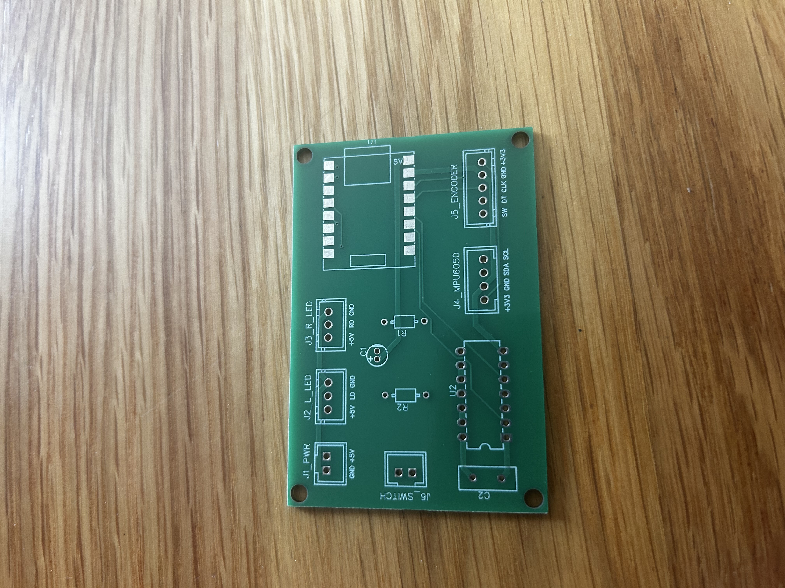
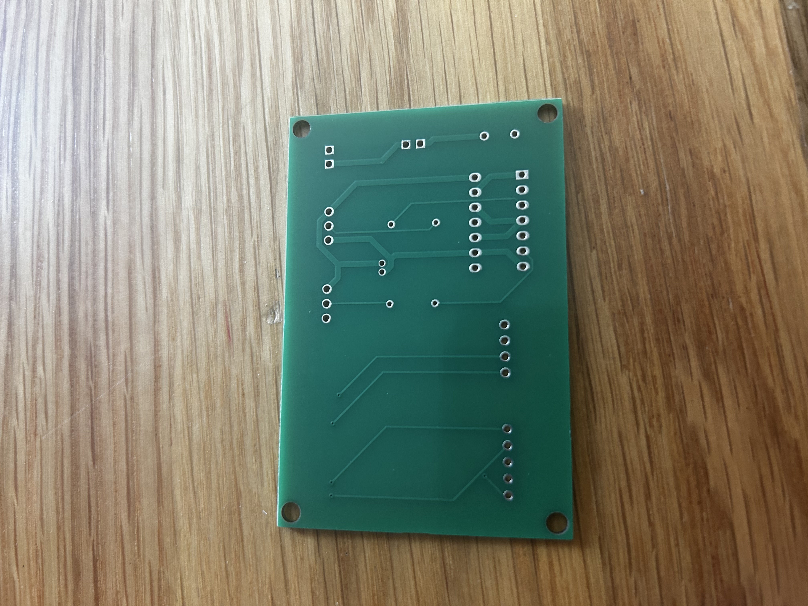
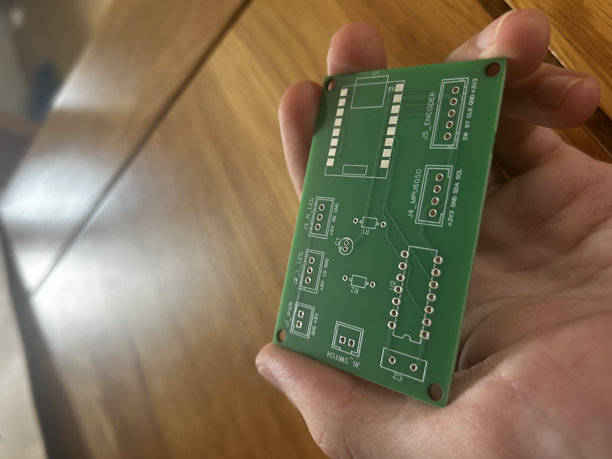

# PCB Design

## Overview

The custom PCB was designed in EasyEDA to replace the validated breadboard prototype and provide a compact, permanent controller for the MR2 reactive LED system.

The PCB integrates the main control electronics and provides dedicated connections for the system's external components.

The design includes:

- ESP32-C3 Super Mini
- SN74AHCT125N 3.3V to 5V level shifter
- MPU6050 accelerometer connector
- Rotary encoder connector
- Left and right WS2812B LED connectors
- JST-XH connectors
- 5V power input
- Toggle switch connector
- Decoupling capacitors
- Mounting holes

The PCB design was developed from the hardware architecture validated during the breadboard testing phase.

---

## Schematic

The schematic defines the electrical connections between the ESP32-C3, level shifter, accelerometer, rotary encoder, LED outputs, power supply, and external connectors.

The SN74AHCT125N level shifter is used to convert the ESP32-C3's 3.3V WS2812B data signal to a 5V logic-level signal.

The PCB also provides dedicated connectors for the external system components, allowing the controller to be assembled and installed without requiring direct soldered connections to the main board.

---

## PCB Layout

The PCB uses a two-layer FR4 design with dedicated 5V power routing.

Component placement and routing were developed based on the validated breadboard prototype. The layout was designed to provide a compact arrangement of the control electronics while maintaining accessible connections for the external components.

The PCB layout was checked using EasyEDA's:

- Electrical Rule Check (ERC)
- Design Rule Check (DRC)

The completed layout was reviewed against the schematic and breadboard prototype before manufacturing.

---

## 2D Preview

The 2D PCB previews show the final board outline, copper layout, component placement, mounting holes, and connector positions before manufacture.

---

## 3D Preview

The 3D render was used to review the physical arrangement of components, connector placement, and overall board layout before manufacturing.

---

# Design Files

The PCB manufacturing files and editable design files are available below.

## Gerber Files

Manufacturing files generated from EasyEDA:

[Gerber Files](../hardware/pcb/gerbers/)

The Gerber files contain the manufacturing data required to produce the physical circuit boards.

---

## PCB Bill of Materials (BOM)

The PCB BOM contains the components and reference designators used during PCB assembly.

The PCB was manufactured as a bare board. Components were sourced separately and manually soldered during assembly.

[PCB BOM Files](../hardware/pcb/bom/)

---

## System Bill of Materials (BOM)

The complete project BOM includes components outside of the PCB assembly, including wiring, power components, LED strips, and installation hardware.

[System BOM](../hardware/bom/MR2_Reactive_LEDs_System_BOM.xlsx)

---

## EasyEDA Source

Original editable PCB design source:

[EasyEDA Source Files](../hardware/pcb/easyeda/)

The EasyEDA source files allow the schematic and PCB layout to be reviewed or modified.

---

# Manufacturing

The PCB manufacturing files were generated after completing the schematic and PCB layout design.

The manufacturing process included:

- Schematic design
- PCB layout
- Electrical Rule Check (ERC)
- Design Rule Check (DRC)
- Gerber file generation
- PCB manufacture

The Gerber files were submitted to JLCPCB for manufacture.

The order consisted of bare manufactured PCBs only. No components were assembled by the manufacturer.

Multiple PCBs were manufactured, providing additional boards for assembly, testing, and development.

---

## Manufactured PCB Inspection

The manufactured PCBs were visually inspected before component assembly.

The boards were checked for:

- Correct dimensions
- Correct PCB shape
- Connector and mounting hole positions
- Solder pad condition
- Visible manufacturing defects
- Correct board finish
- General alignment with the EasyEDA design

Continuity testing was also performed before soldering components.

The tested connections were found to be correct, with no unexpected shorts or open connections identified.

### Bare PCB Photos

Photos documenting the manufactured PCBs before component assembly are included below.

---

# PCB Assembly

Components were manually soldered onto the manufactured PCB.

The assembly process included:

- Visual inspection of the manufactured PCB
- Continuity testing before assembly
- Soldering the ESP32-C3 Super Mini
- Soldering the SN74AHCT125N level shifter
- Soldering connectors and supporting components
- Inspection of solder joints
- Power-on testing
- Testing the LED outputs
- Testing the rotary encoder
- Testing the MPU6050 accelerometer

The first assembled PCB successfully operated most of the system but developed an issue with GPIO4, which prevented the rotary encoder from correctly adjusting LED brightness.

---

## Initial PCB Assembly Fault

The first assembled PCB was tested progressively to identify the cause of the rotary encoder brightness adjustment failure.

The rotary encoder was connected using:

- GPIO4 — CLK
- GPIO5 — DT

GPIO5 operated correctly, while GPIO4 did not respond correctly.

Testing showed that:

- The physical GPIO4 signal was measured changing between approximately 0 V and 3.3 V when the encoder was rotated.
- GPIO4 did not respond correctly when read using `digitalRead(4)`.
- GPIO5 operated correctly using the same testing method.
- GPIO4 was tested using a simple software input test but continued to remain in an incorrect state.
- GPIO4 was also tested using a simple output test and did not behave as expected.
- GPIO7 was tested as an alternative GPIO for the encoder CLK signal and operated correctly.
- The rotary encoder itself was confirmed to be functioning correctly.
- The PCB wiring and encoder circuit were confirmed to be functional.

Further inspection suggested that the GPIO4 connection on the first ESP32-C3 Super Mini may have been physically damaged or compromised during assembly. Solder was also found not to wet the suspected GPIO4 connection correctly.

The fault was therefore isolated to the first ESP32-C3 assembly rather than the PCB design or rotary encoder circuit.

The first assembled PCB was retained as a development and troubleshooting board.

---

# Replacement PCB Assembly

A replacement manufactured PCB was assembled using a new ESP32-C3 Super Mini.

The replacement PCB was visually inspected and continuity tested before assembly.

The new ESP32-C3 Super Mini was then soldered to the PCB and tested progressively before completing the remaining hardware assembly.

The following functions were verified:

- ESP32-C3 powered correctly
- GPIO4 operated correctly
- GPIO5 operated correctly
- Rotary encoder CLK and DT signals were detected correctly
- Rotary encoder brightness adjustment operated correctly
- Rotary encoder button operated correctly
- WS2812B LED outputs operated correctly
- SN74AHCT125N level shifter operated correctly
- MPU6050 accelerometer communicated successfully
- Accelerometer-based reactive lighting operated correctly

The replacement PCB successfully reproduced the functionality previously validated during the breadboard prototype testing.

### PCB Assembly Photos

Photos documenting the completed PCB assembly and testing process are included below.

---

# PCB Validation

The replacement PCB was fully validated before integration into the control box.

Testing confirmed correct operation of:

- ESP32-C3
- Rotary encoder
- Rotary encoder brightness adjustment
- Rotary encoder mode selection
- WS2812B LED outputs
- SN74AHCT125N level shifting
- MPU6050 communication
- Accelerometer-based reactive lighting

The PCB was confirmed to operate correctly with the complete hardware system and was suitable for integration into the final control box.

---

# Control Box Integration

The validated PCB was installed into a protective control box to provide a secure enclosure for the controller electronics.

The PCB was securely mounted inside the enclosure using two M3 screws.

A 12V to 5V buck converter was also installed inside the control box to provide the regulated 5V supply required by the PCB.

External wiring was routed through a cable gland installed on the side of the enclosure.

The control box provides connections for:

- 12V vehicle power input
- Master power switch
- Left WS2812B LED strip
- Right WS2812B LED strip
- Rotary encoder
- MPU6050 accelerometer

The completed control box was functionally tested using a temporary regulated 5V power supply.

All major system functions operated correctly with the PCB and buck converter installed inside the completed enclosure.

The buck converter is installed inside the control box but will be tested using the vehicle's 12V supply during vehicle installation.

### Control Box Photos

Photos documenting the completed control box and PCB installation are included below.

