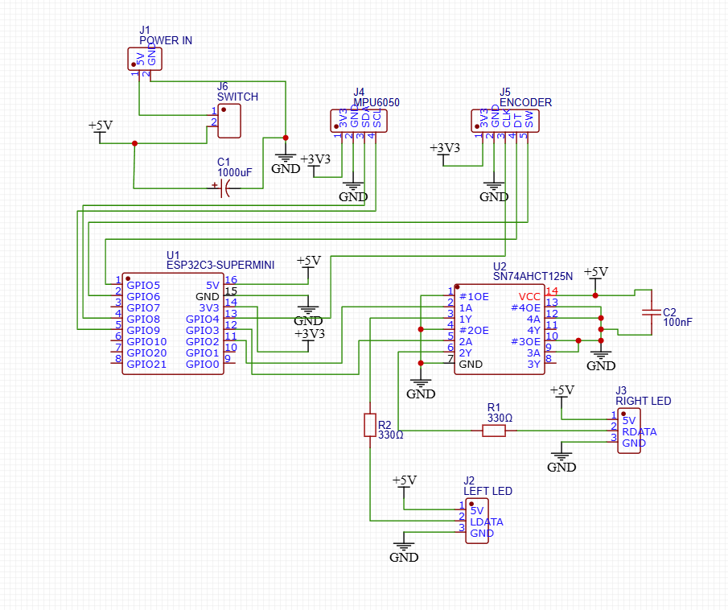
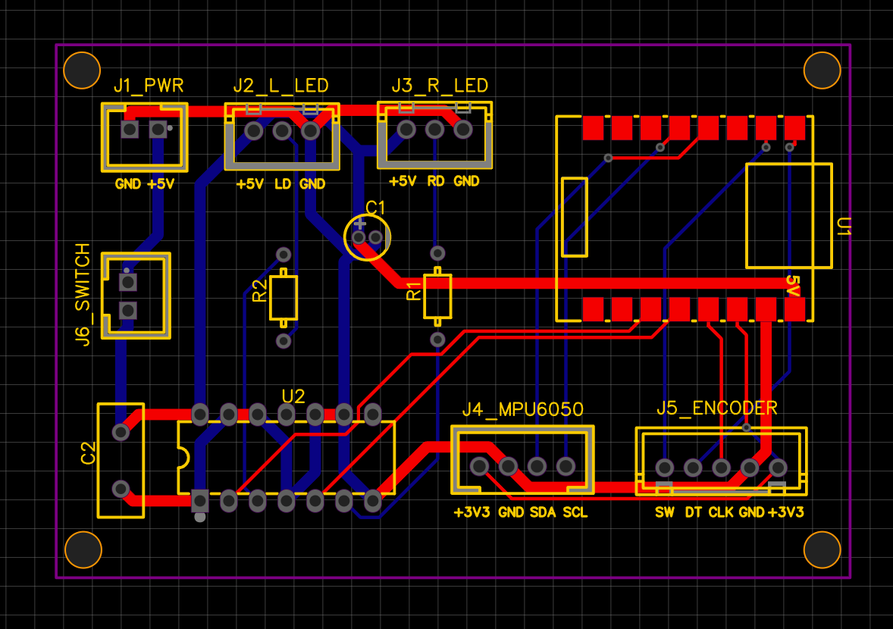
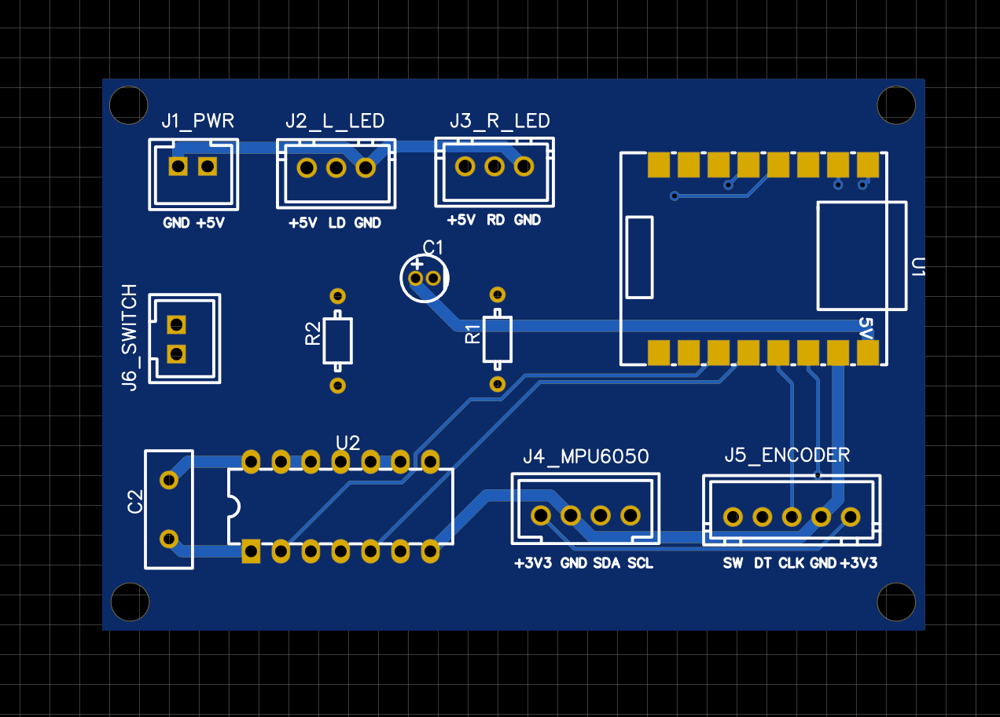
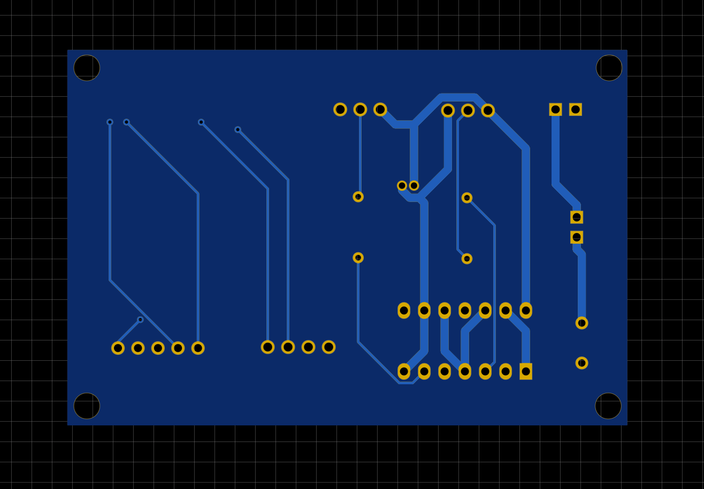
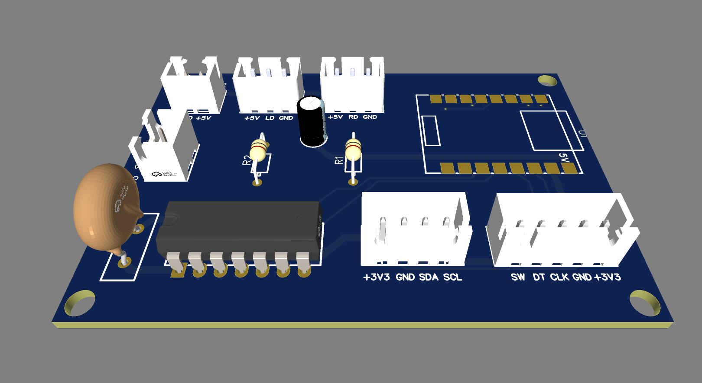

# PCB Design

## Schematic

 

The PCB was designed in EasyEDA around the ESP32-C3 Super Mini.

---

## PCB Layout

Two-layer PCB with separate 5V power routing.

---
## 2D Preview

---

## 3D Preview

3D render before manufacture.

---

## Manufactured PCB

Pending.

PCB received from JLCPCB.

---

## Assembled PCB

Pending.
